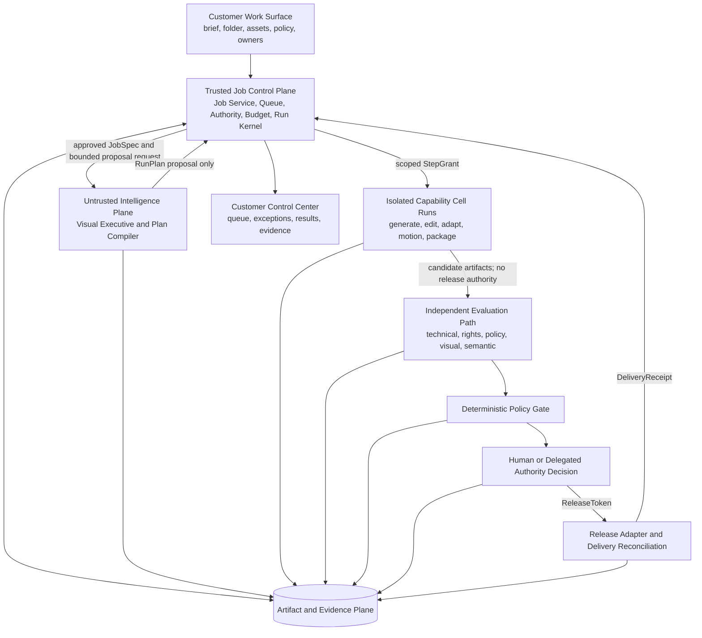
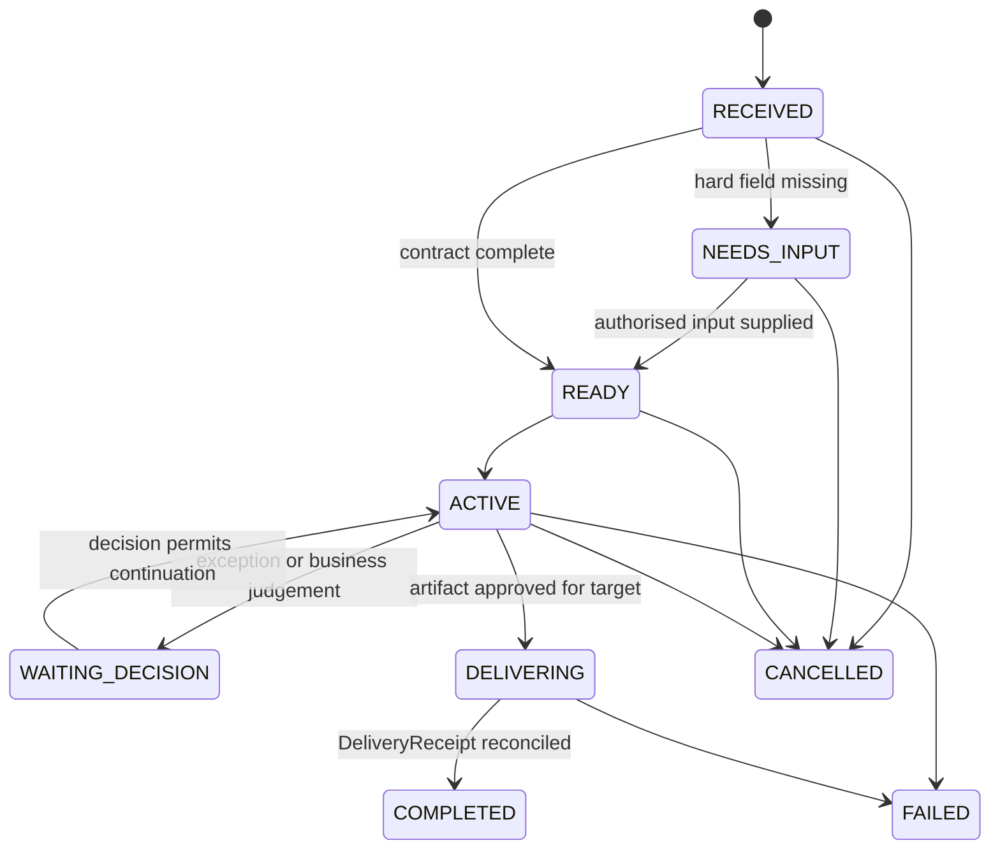
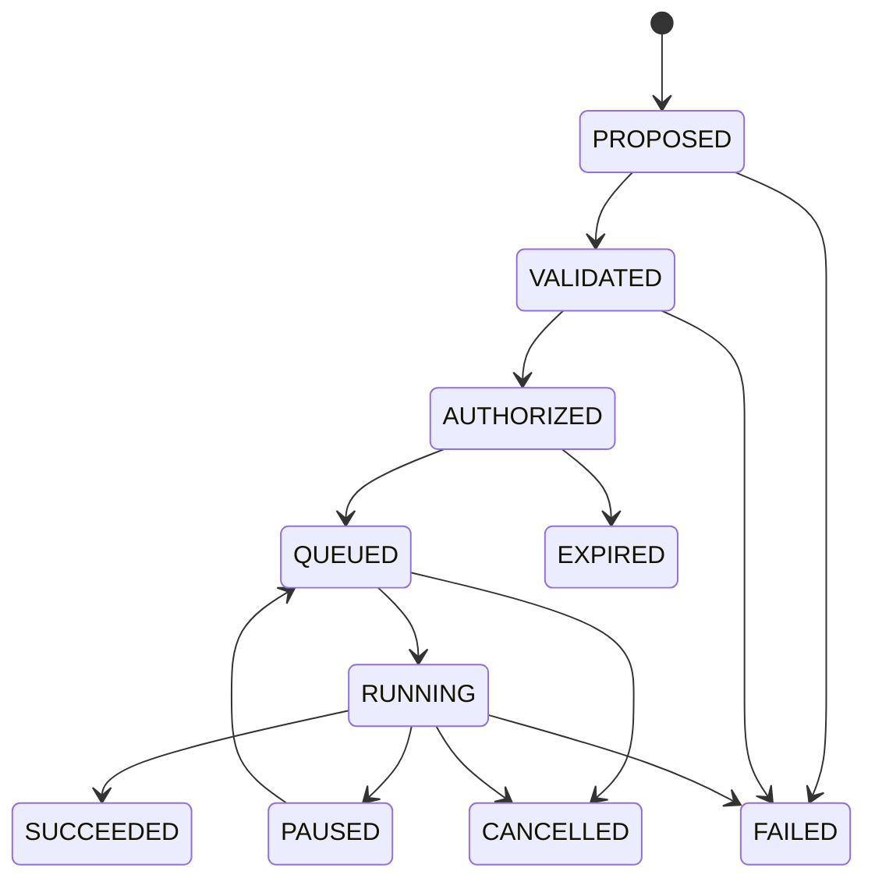
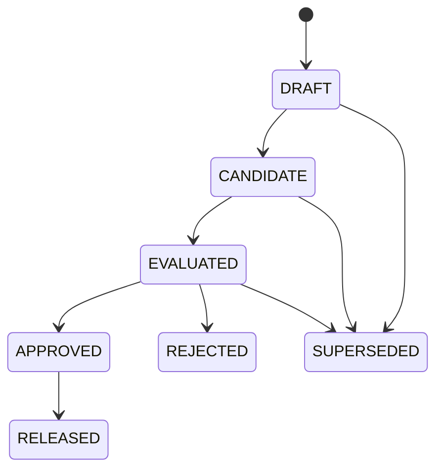
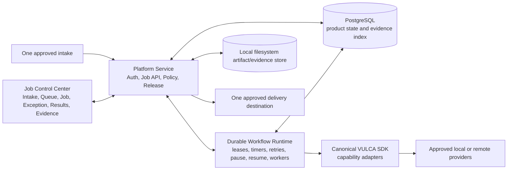

# VULCA Accountable Creative Organization Runtime

> **Status: historical (2026-08-11).** On 2026-08-14 VULCA moved Job Runtime ownership to the DSH/Cordis-derived native kernel in `vulca-platform` (see its `docs/product/2026-08-14-vulca-unified-product-prd.md`). The capability contracts in `src/vulca/capability/` (plan 01) remain canonical and are consumed by that kernel as a sidecar; the runtime plans 02–06 in this series are superseded by the platform-side milestones and are kept only as design record.

**Date:** 2026-08-11

**Status:** Product constitution and system design confirmed; competitive-completeness amendment incorporated; implementation plan package written; product implementation not started

**Product path:** C → D is the implementation and trust-acquisition sequence, not a reduction of product scope: first make one end-to-end responsibility highly reliable, then compose several reliable responsibilities into an operating unit

**Implementation authority:** This document authorises planning only. It does not claim that the target runtime, enterprise deployment, customer adoption, or role replacement already exists.

**Confirmed implementation plan:** [VULCA Accountable Runtime Program](../plans/2026-08-11-vulca-runtime-program.md), with six dependency-ordered subsystem plans. Plan existence is not implementation evidence.

## 1. Executive decision

VULCA will become an **accountable creative-organization runtime**: at company scope it covers the complete internal creative-production chain, from business text/brief and authorised source material through planning, generation, editing, adaptation, independent review, repair, approval, packaging, delivery, and governed learning. A company assigns VULCA a bounded, recurring part of that chain; VULCA owns the accepted queue and the end-to-end result inside the declared authority boundary.

The customer-facing product is not generic Agent infrastructure. It is a concrete digital operating unit that fits an existing organizational boundary. Internally, however, it is built on reusable Agent infrastructure: versioned Job contracts, typed Capability Cells, a trusted execution kernel, independent evaluators, authority gates, and append-only evidence.

The vision and first implementation breadth are deliberately different, but neither is review-only or generation-only:

- **Company product scope:** the complete internal creative-production chain, represented by reusable JobClasses and composed Operating Units rather than one giant Agent.
- **First implementation:** one bounded static-campaign JobClass that traverses the whole chain from business input to governed delivery and learning candidates, can be deployed locally, observed in Shadow mode, and promoted only through evidence.
- **First commercial claim:** a paid production Pilot for a named responsibility.
- **Not yet allowed:** claiming that VULCA has replaced an entire Art Director, Technical Artist, reviewer, creative team, or company function.

The core product promise is:

> Connect one recurring creative-production queue, define its authority and acceptance contract, then let VULCA receive, produce, evaluate, package, and deliver the work.

### 1.1 Non-negotiable product constitution

The following rules outrank individual features, legacy interfaces, repository history, and temporary implementation convenience:

1. **Complete company chain:** VULCA's product map covers business intake, planning, generation, transformation, review, repair, decision, packaging, delivery, and governed learning. It is not merely an evaluation layer wrapped around third-party generators.
2. **Complete activated responsibility:** an activated JobClass owns its contracted routine from accepted input to DeliveryReceipt. A customer must not need to leave VULCA and manually complete a routine middle step in a competitor interface.
3. **Competitor capability union as the floor:** inside a selected JobClass, VULCA must cover the union of competitor capabilities required for routine completion. It may call a competitor, model, or external tool as an invisible Capability Cell, but VULCA retains the Job state, policy, evidence, exception, and delivery responsibility.
4. **Better on declared operating metrics:** parity alone is insufficient. Before promotion, the JobClass must declare where it is measurably better—for example accepted-output rate, human minutes, cycle time, cost per accepted Job, policy compliance, incident rate, or recovery quality.
5. **At least one exclusive responsibility advantage:** the JobClass must add something isolated tools do not provide, such as cross-tool accountability, bounded authority, model portability, private/local execution, durable recovery, end-to-end evidence, or governed organizational learning.
6. **C → D is execution order:** VULCA designs the whole chain now, proves one complete C vertically, and then composes reliable Cs into D. It does not postpone generation, delivery, or learning because they belong to a later product phase.
7. **Interface subtraction:** customers provide objectives, inputs, constraints, authority, and exceptions; VULCA owns orchestration. Infinite canvases, customer-authored DAGs, and prompt plumbing are not the normal operating surface.

Any feature or roadmap item that violates these rules is out of direction even if it is technically impressive.

### 1.2 Complete creative-production chain

```mermaid
flowchart LR
    Intent["Business text, brief, objectives"]
    Intake["Contracted intake and rights"]
    Plan["Creative and production plan"]
    Produce["Generate, edit, transform"]
    Adapt["Variants, channels, formats"]
    Review["Independent technical, policy, semantic, visual review"]
    Repair["Repair or explicit exception"]
    Decide["Human or delegated decision"]
    Package["Package, naming, manifests"]
    Deliver["Delivery and receipt"]
    Learn["Evidence and governed memory candidates"]

    Intent --> Intake --> Plan --> Produce --> Adapt --> Review --> Repair --> Decide --> Package --> Deliver --> Learn
    Repair -->|"new artifact version"| Review
```



This is the canonical chain map. Media types, channels, role labels, and company departments are variations on this spine. The architecture must support every stage from the beginning; implementation expands by completing one vertical slice at a time, not by shipping disconnected horizontal tools.

At company scope, production may include copy development, image, video, audio, 3D, presentation, UI, or other creative artifacts. The first static-campaign vertical accepts approved business copy and generates the visual campaign set; that entry point is an implementation choice, not a definition of VULCA as “game art”, image-only software, or one job title.

## 2. Why this is the selected direction

### 2.1 The customer buys responsibility, not orchestration

Infinite canvases, node editors, prompt studios, and role-playing multi-agent chats transfer orchestration work to the customer. That is incompatible with the intended product: the customer should specify the outcome, authority, policy, and exceptions; VULCA should own the internal plan.

VULCA therefore exposes:

- a work queue instead of a pipeline canvas;
- explicit exceptions instead of open-ended chat supervision;
- accepted artifacts and delivery receipts instead of model output alone;
- evidence and bounded authority instead of a generic confidence score;
- organizational JobClasses instead of a marketplace of Agent personas.

### 2.2 VULCA includes Agent infrastructure but is not sold as Agent infrastructure

The internal runtime is an Agent platform. The commercial product is a vertical operating system for creative work.

| Layer | What it is | Who should care |
|---|---|---|
| Company-facing product | Named work queues and responsibilities | Sponsor, workflow owner, operator |
| Organization Pack | Company language, defaults, policies, JobClasses, evaluators | Operator and implementation owner |
| Agent Runtime | Planning, contracts, grants, execution, recovery, evidence | VULCA engineering |
| Capability Cell layer | Typed generation, editing, evaluation, packaging, and integration capabilities | VULCA engineering and advanced debugging |

“AI Art Director”, “AI TA”, “AI Reviewer”, “Campaign Production Unit”, and future role labels are customer-facing compositions configured through Organization Packs, OperatingUnits, and JobClasses. They are not privileged Agent types and must not cause separate backend forks.

### 2.3 C → D is the scale path

The product must not attempt to implement a whole virtual company as one probabilistic Agent.

1. **C — atomic responsibility:** one versioned JobClass owns a recurring, measurable unit of work.
2. **Reliable C:** the JobClass meets declared quality, intervention, SLA, cost, incident, and recovery gates on a representative queue.
3. **Composed C:** several reliable JobClasses share artifacts and policy through typed contracts.
4. **D — operating unit:** the composed system owns a larger work queue; humans handle declared exceptions rather than routine execution.

Adding more model calls, media types, or role labels does not move VULCA from C to D. Only verified queue coverage and operating evidence do.

### 2.4 Competitive completeness is a release gate

Each JobClass owns a versioned **Capability Coverage Ledger**. Every routine competitor capability and every stage in the contracted chain receives one implementation route plus evidence qualifiers:

| Axis | Status | Meaning |
|---|---|---|
| Implementation route | `NATIVE` | Implemented through a VULCA-owned Cell contract and operated directly by the runtime |
| Implementation route | `ADAPTED` | Supplied through an external product/model/tool behind a VULCA adapter; the customer remains inside the VULCA workflow |
| Implementation route | `MISSING` | Required routine capability is absent or requires manual escape from VULCA |
| Evidence qualifier | `UNPROVEN` | A route exists, but representative evidence is not sufficient for parity, superiority, or exclusivity |
| Evidence qualifier | `BETTER` | Demonstrably exceeds the strongest relevant baseline on a predeclared operating metric |
| Evidence qualifier | `EXCLUSIVE` | Provides a responsibility or control the comparison products do not provide |

A JobClass cannot be called complete while any required routine step is `MISSING`. A row can therefore be `ADAPTED + BETTER`, `NATIVE + UNPROVEN`, or another valid combination. `NATIVE` is not automatically better than `ADAPTED`; VULCA should own the contract and responsibility first, and only replace an adapted capability when quality, cost, control, data, or reliability justifies native implementation. `BETTER` and `EXCLUSIVE` require evidence rather than product-copy assertions.

Coverage routes and Cell maturity are related but not identical. `NATIVE` coverage requires VULCA-owned Cell contracts; `ADAPTED` coverage may compose `ORCHESTRATED` or bounded `INTEGRATED` Cells as defined in section 8, provided the normal customer workflow remains inside VULCA; `MISSING` means no acceptable route exists. This prevents a provider integration from being mistaken for a proven JobClass advantage.

### 2.5 Full product breadth, vertical implementation

VULCA does not need to reproduce every competitor's interface. It must reproduce or adapt the capabilities that the selected responsibility needs, then remove the integration and supervision burden around them.

The implementation rule is therefore:

1. map the full company chain and competitor capability union;
2. select one commercially coherent vertical responsibility;
3. complete that responsibility from intake to receipt;
4. prove parity, a measurable advantage, and at least one exclusive responsibility advantage;
5. expand to adjacent JobClasses on the same runtime and evidence spine.

This preserves the large product ambition without asking one founder to build every medium, department, and interface simultaneously.

## 3. Evidence boundary: current state versus target state

This specification is a target design. It must not be used as evidence that the target product has shipped.

### 3.1 Existing foundations

The current repositories document useful foundations:

- VULCA SDK/MCP capabilities for generation, image inspection, semantic decomposition, pixel/layer editing, provider routing, evaluation, and artifact workflows;
- agent-native visual skills and structured artifacts;
- a VULCA Workspace preview with review triage, single-asset review, evidence context, decisions, and a visible human-release boundary.

Relevant existing descriptions are:

- [Agent-native architecture design](2026-04-16-agent-native-architecture-design.md)
- [VULCA Workspace current-state audit](../../product/workspace-current-state-audit.md)
- [VULCA product positioning brief](../../product/2026-04-30-product-positioning-brief.md)

### 3.2 Known current boundary

The historical Workspace audit correctly records the state it inspected: a frontend/session-local preview. Later `vulca-platform` branches added real foundations—SQL persistence, users and membership, revision-conflict handling, typed audit events, EvidencePack/ReleaseGate records, and a model-backed review API. Those additions make the old Workspace more than a static mock, but they still do not establish the target runtime.

The current boundary is:

- the old Workspace's primary ontology is `CreativeRepo` / `ReviewItem` / review decision, not Organization / JobClass / Job / Run / delivery;
- its page still seeds the experience from sample creative-repository data rather than accepting and owning a production queue end to end;
- asynchronous review work relies on web-process background tasks rather than a durable, lease-based, restart-safe workflow runtime;
- the current V8 product route sends `/workspace` to `/builder`, while the visible demo explicitly uses illustrative data and does not prove live model execution;
- neither UI generation, persisted review records, nor a demo pipeline proves enterprise deployment, customer use, operating ownership, or role replacement.

The following are target capabilities introduced by this design and must be implemented and tested:

- durable Job Service, scheduler, and Run Kernel;
- scoped authority grants and external-write reconciliation;
- immutable artifact/evidence store;
- independent evaluation and deterministic policy gating;
- TrustDecision promotion and automatic demotion;
- local customer deployment and restart-safe execution;
- paid Shadow Pilot and real-queue operating evidence.

### 3.3 Claim rule

Local builds, demos, screenshots, mock providers, advisory reviews, sender-side activity, or test success are not evidence of deployment, customer adoption, human acceptance, role replacement, or commercial traction.

Every outward-facing claim must carry one of these evidence statuses:

- `DEMO`
- `PILOT`
- `ASSISTED`
- `AUTOMATED`
- `OWNED`
- `REPLACED`

### 3.4 Legacy collision and canonical ownership

Three existing product shapes currently compete for the meaning of “VULCA”; the target runtime must converge them rather than create a fourth parallel product.

| Existing shape | Real value to preserve | Structural conflict with the target | Canonical future role |
|---|---|---|---|
| VULCA SDK/MCP in `vulca` | Generation, editing, decomposition, evaluation, provider routing, visual skills, typed artifacts | Public language says VULCA supplies the Agent's “hands and eyes, not the brain”; this is too narrow for the company product | The single canonical Capability SDK used by runtime adapters |
| Legacy Workspace in `vulca-platform` | Review triage, evidence context, memberships, persistence, audit patterns, decision and release-gate concepts | ReviewItem-first; generation and delivery are adjacent actions rather than one owned Job; browser/web-process execution is not a trusted workflow runtime | Migrate useful UI and service patterns into the Job Control Center; retain a read-only migration adapter for old records |
| Current V8 website/builder/demo in `vulca-platform` | Acquisition narrative, polished shell, enterprise production-line story, replayable demo | `/workspace` is not the new runtime; illustrative demo state can visually overclaim execution and operating evidence | Acquisition, onboarding, demo/replay, and the frontend shell for the real Job runtime |

There is also a code-level collision: `vulca-platform` contains a vendored VULCA backend around version `0.12.0`, while the standalone SDK is around version `0.23.1`, and same-named implementation files have diverged. This is not an acceptable permanent architecture. The platform must consume one pinned canonical SDK through adapters; the vendored copy is removed only after a compatibility and migration check.

The repository ownership decision is:

- `vulca` owns the canonical Capability SDK, manifests, adapters, capability-level tests, and visual skills;
- `vulca-platform` owns the customer product, Job runtime, durable state, control-center UI, public site, onboarding, and demo/replay surfaces;
- historical Workspace data and routes are migrated or explicitly frozen, never maintained as a competing product ontology;
- no new feature may introduce a parallel Job model, evidence store, runtime scheduler, or public “main product” surface.

Old README, roadmap, and positioning statements that define VULCA only as a visual-control layer or explicitly avoid broader creative-production competition become historical documents. They may remain for provenance, but they are not canonical product direction after this specification.

## 4. Product definition

### 4.1 Customer contract

The customer gives VULCA:

- a bounded recurring work queue;
- authorised input assets and their rights/provenance;
- BrandPack and PolicyPack versions;
- explicit acceptance criteria;
- an authority, budget, data, and destination envelope;
- a named Executive Sponsor and Workflow Owner;
- named owners for missing input, policy conflicts, and release decisions.

VULCA owns execution inside that boundary. No probabilistic component may expand the boundary or approve itself.

### 4.2 Product objects

| Object | Purpose |
|---|---|
| `Organization` | Customer boundary for policy, data, people, operating evidence, and deployment |
| `OrganizationPack` | Company vocabulary, dashboard language, policies, defaults, JobClasses, and escalation owners |
| `BrandPack` | Versioned brand identity, tone, assets, constraints, examples, and authorised usage rules |
| `PolicyPack` | Versioned rights, safety, data, channel, evaluation, release, retention, and learning rules |
| `OperatingUnit` | Composition of reliable JobClasses that owns a larger organizational work queue |
| `JobClass` | Versioned template for one recurring business responsibility |
| `CapabilityCoverageLedger` | Versioned map from a JobClass's full routine and competitor-capability union to implementation routes, evidence qualifiers, baselines, and gaps |
| `Job` | Durable instance of accepted work with business state and one or more immutable JobSpec versions |
| `JobSpec` | Immutable contract for one accepted work request |
| `Run` | One authorised attempt to satisfy an exact JobSpec version |
| `RunPlan` | Declarative, versioned proposal for satisfying one JobSpec version |
| `CapabilityManifest` | Typed contract for one replaceable Capability Cell |
| `Step` | Durable execution record for one StepSpec and its attempts |
| `StepSpec` | Exact planned unit of work bound to inputs, outputs, and dependencies |
| `StepGrant` | Narrow, revocable authority token for one side effect or spend boundary |
| `Artifact` | Logical creative or operational output with immutable versions and lineage |
| `ArtifactManifest` | Immutable artifact version, hashes, media types, parents, and provenance |
| `EvalSpec` | Versioned evaluation dimensions, evaluator bindings, and thresholds |
| `EvalReport` | `PASS`, `FAIL`, or `ABSTAIN` plus uncertainty and evidence |
| `DecisionRecord` | Human or delegated business decision over exact artifact/evaluation versions |
| `ReleaseToken` | Short-lived authority to release exact artifact hashes to an exact destination |
| `DeliveryReceipt` | Destination acknowledgement of the exact version received |
| `EvidenceEvent` | Append-only causal record of reads, plans, grants, actions, versions, decisions, and writes |
| `MemoryCandidate` | Proposed reusable company knowledge derived from evidence; inert until policy and authorised review promote it |
| `TrustDecision` | Signed promotion, restriction, expiry, or demotion for a bounded authority unit |

### 4.3 Canonical granularity and terminology

```text
Organization
├── OrganizationPack
└── OperatingUnit
    └── JobClass
        └── Job
            ├── JobSpec versions
            └── Run
                ├── RunPlan
                └── Step → Capability Cell
                     ├── Artifact versions
                     ├── EvalReports
                     └── EvidenceEvents
```

The granularity rules are:

- a **Capability Cell** does one typed operation; it is not a sellable employee persona;
- a **JobClass** is the smallest sellable and independently promotable responsibility, and it must be end-to-end complete for its contract;
- an **OperatingUnit** composes several reliable JobClasses and owns cross-Job handoffs;
- an **OrganizationPack** configures company vocabulary, policies, memory, owners, and available units without forking the runtime;
- “AI Art Director”, “AI TA”, “AI Reviewer”, and department labels are OrganizationPack/OperatingUnit/JobClass compositions, never alternate core schemas or backend branches;
- “generation”, “review”, and “delivery” describe stages or Cells, not separate VULCA products.

### 4.4 Non-goals

The MVP is not:

- an infinite canvas;
- a customer-authored DAG or pipeline builder;
- an Agent marketplace;
- a swarm of role-playing chat agents;
- a generic one-shot image generator;
- a thin wrapper that sends users into several competitor products to finish one routine Job;
- autonomous public publishing;
- a multi-tenant cloud platform;
- a cross-customer learning system;
- an outcome-billing engine;
- proof that a whole job title has been replaced.

## 5. System architecture and trust boundary

### 5.1 Logical architecture



### 5.2 Trusted Job Control Plane

The trusted control plane is the source of truth for what may happen.

#### Job Service

- stores immutable JobSpec versions;
- applies idempotency keys at intake;
- owns the business-state machine;
- invalidates stale plans and grants when a hard contract field changes.

#### Queue and Scheduler

- leases work to workers;
- enforces timeout, cancellation, concurrency, and dead-letter behavior;
- releases leases while waiting for missing business input;
- resumes from durable state rather than browser state.

#### Authority and Budget

- checks action, provider, data scope, destination, channel, risk tier, spend, attempts, runtime, and expiry;
- issues narrow StepGrants;
- supports explicit revocation and authority expiry.

#### Run Kernel

- validates all state transitions;
- binds every RunPlan to an exact JobSpec hash;
- rechecks safety-critical compiler output deterministically;
- authorises and schedules isolated steps;
- records the causal event history;
- never delegates its authority to the planner or executor.

### 5.3 Probabilistic Intelligence and Execution Plane

#### Visual Executive

The Visual Executive interprets the business intent and proposes a declarative RunPlan from:

- the approved JobSpec;
- JobClass and OrganizationPack versions;
- the Capability Registry;
- approved tenant memory;
- current PolicyPack constraints;
- available budgets and deadlines.

It cannot add tools, rights, data access, destinations, spend, release authority, or unsupported outputs.

#### Plan Compiler

The Plan Compiler resolves exact Cell versions, types, dependencies, evaluator paths, estimated cost, and requested grants. It may use probabilistic mapping, but its output remains a proposal. Safety-critical type, authority, budget, data, and evaluation checks are deterministic and repeated by the Run Kernel.

#### Capability Cell runs

Cells execute generation, transformation, editing, adaptation, motion, evaluation support, packaging, or integration work. Each Cell receives exact input references and a StepGrant. It has no broad tenant access, no release authority, and no direct access to another Cell's hidden state.

### 5.4 Independent Trust and Release Path

Execution cannot grade or release itself.

1. Candidate artifacts enter an evaluator pool selected by the JobClass and PolicyPack.
2. Evaluators return structured reports; they do not authorise release.
3. The deterministic Policy Gate interprets the required reports and conflict rules.
4. Human or previously delegated authority records a DecisionRecord.
5. The system issues a narrow, expiring ReleaseToken.
6. The Release Adapter writes the exact artifact version.
7. A DeliveryReceipt closes the external side effect.

### 5.5 Hard architecture rules

1. The planner cannot authorise itself.
2. Every side effect requires a scoped StepGrant.
3. Every external write requires a DeliveryReceipt.
4. Every high-risk release requires independent evaluation.
5. No component may infer rights, spend, publishing, data use, acceptance, or release authority.
6. History is immutable; changes create new versions and causal events.
7. Unknown external outcomes enter reconciliation, never blind retry.
8. A release failure cannot be converted into success by a probabilistic explanation.

## 6. Job contract

### 6.1 A Job is not a prompt

A raw request may arrive through a form, message, watched folder, or connector. A Contract Compiler applies the JobClass and tenant PolicyPack and produces a versioned JobSpec.

The Job becomes `READY` only when all hard fields are present and authorised.

### 6.2 JobSpec fields

| Group | Required content |
|---|---|
| Identity and provenance | `job_id`, `tenant_id`, version, `job_class`, idempotency key, requester, source references |
| Objective and deliverables | Business objective, audience, channels, artifact types, quantities, technical formats |
| Context and inputs | Asset references, BrandPack version, PolicyPack version, dependencies, source rights |
| Acceptance contract | Required evaluators, thresholds, hard technical gates, human-decision rules, SLA |
| Authority envelope | Allowed actions, providers, channels, write scope, release scope, risk tier |
| Resource envelope | Deadline, maximum spend, attempts, runtime, concurrency, provider restrictions |
| Delivery contract | Destination, package shape, naming, exact artifact version, receipt requirement |
| Escalation and data policy | Missing-input owner, failure owner, retention, privacy, learning permission |

### 6.3 Field provenance

Every normalised field records one of:

- `PROVIDED`: supplied by an authorised source, with a retained reference;
- `INFERRED`: allowed only for descriptive context, with confidence and evidence basis;
- `APPROVAL_REQUIRED`: rights, spend, publishing, data use, acceptance, and authority; never inferred.

Missing authority produces `NEEDS_INPUT`, not a best guess.

### 6.4 Version invalidation rule

Changing acceptance, authority, source rights, destination, data policy, or budget creates a new JobSpec version and invalidates all stale RunPlans, StepGrants, and ReleaseTokens derived from the prior version.

## 7. Runtime state model

Business state, technical execution, and artifact approval are separate state machines joined by immutable references.

### 7.1 Job state



### 7.2 Run state



### 7.3 Artifact state



### 7.4 Runtime invariants

- No approved JobSpec → no Run.
- No StepGrant → no provider spend, file write, or customer-system call.
- No EvalReport → no artifact approval.
- No ReleaseToken → no release.
- No DeliveryReceipt → Job is not complete.
- No mutation of prior Job, plan, artifact, evaluation, or decision versions.
- A repair Run creates a new artifact version; it never overwrites the rejected candidate.

### 7.5 Failure routing

| Failure | Required response | Forbidden behavior |
|---|---|---|
| Missing or ambiguous input | Job → `NEEDS_INPUT`; release lease; spend nothing | Paying a provider to guess the contract |
| Transient provider failure | Bounded retry within the same StepSpec | Unbounded retry or hidden budget increase |
| Quality failure | New repair Run and artifact version, or `WAITING_DECISION` | Overwriting the rejected artifact |
| Rights or policy failure | Block; require authorised policy/input change | Automatic retry or evaluator shopping |
| Evaluator conflict or abstention | Escalate with reports and uncertainty | Averaging disagreement into a pass |
| Budget or deadline exhaustion | Pause/stop and request a new JobSpec version | Continuing on inferred authority |
| Unknown delivery outcome | Enter reconciliation and query destination | Blind retry that may duplicate release |
| Cancellation or revocation | Revoke future grants; quarantine late results | Treating late provider output as authorised |
| Runtime crash | Replay events/checkpoints and resume idempotently | Reconstructing state from UI or memory |

## 8. Capability Cell protocol

### 8.1 Definition

A Cell is a typed, versioned, replaceable capability. It is not a conversational persona.

Its manifest contains:

| Group | Required content |
|---|---|
| Identity and version | Capability ID, version, kind, owner, maturity, deprecation state |
| Typed inputs and outputs | Schemas, media types, required refs, ArtifactManifest shape |
| Execution profile | Tool/provider adapter, deterministic/stochastic mode, sandbox, data locality |
| Authority requirements | Read scopes, provider spend, file writes, external side effects |
| Resource profile | Cost estimate, latency range, timeout, concurrency, cache policy |
| Evaluator bindings | Required checks, thresholds, calibration version, uncertainty route |
| Failure contract | Retryable codes, compatible fallback, compensation, quarantine behavior |
| Evidence hooks | Provider receipt, step events, hashes, customer-safe logs |

### 8.2 Maturity levels

| Maturity | Meaning |
|---|---|
| `NATIVE` | VULCA owns the typed contract, test corpus, evaluator binding, replay behavior, and operational target; the base model may remain external |
| `ORCHESTRATED` | A stable adapter controls an external provider/tool and records evidence, but reliability or fallback remains provider-dependent |
| `INTEGRATED` | VULCA can hand work to an external app or human and receive a result/receipt, but cannot own internal execution |
| `UNSUPPORTED` | No compatible contract or evidence route exists; planner must refuse or escalate |

Capability maturity and JobClass operating status are different. A JobClass may compose external `ORCHESTRATED` Cells and still become reliable if the full contract is measured and failure is bounded.

### 8.3 Orchestration sequence

1. Visual Executive reads an approved JobSpec and proposes a RunPlan.
2. Plan Compiler resolves exact Cell versions and evaluator paths.
3. Run Kernel validates types, maturity, authority, data, budget, deadline, and independent-evaluation coverage.
4. Authority service issues scoped StepGrants.
5. Scheduler runs isolated Cells.
6. Cells emit immutable artifacts, receipts, failures, and safe summaries.
7. Run Kernel mediates every artifact handoff.
8. Independent evaluators assess the candidate.
9. Policy Gate chooses pass, repair, block, abstention escalation, or human decision.

### 8.4 Orchestration invariants

- No Cell-to-Cell calls.
- No shared hidden scratch context.
- No spontaneous replanning.
- No hidden self-evaluation.
- No silent provider fallback.
- No unsupported plan.
- No private chain-of-thought product surface.
- Only immutable artifact references cross step boundaries.

### 8.5 Replanning

Replanning is explicit and versioned. A PlanRevision may be proposed only for:

- missing or incompatible input;
- declared capability unavailability;
- a repairable EvalReport failure;
- an authorised human or policy change.

A fallback must satisfy the same output/evaluation contract, receive a new cost estimate, and pass a fresh grant decision. A JobSpec change creates JobSpec `v+1`; an implementation-only change creates RunPlan `v+1`.

### 8.6 Initial planning boundary

The MVP supports bounded plan synthesis over two approved templates. The planner may select compatible Cells, providers, and declared repair routes. It may not invent arbitrary tools, unbounded loops, or new graph structures.

General dynamic planning is deferred until replay and Golden Job evidence demonstrate that template-bound orchestration is insufficient.

## 9. Evaluation, evidence, and trust

### 9.1 Independent evaluation stack

| Layer | Responsibility |
|---|---|
| Technical validators | File integrity, dimensions, codec, colour profile, safe area, naming, package completeness |
| Rights and policy checks | Provenance, licence, consent, prohibited content, channel policy, BrandPack constraints |
| Visual and semantic judges | Brief alignment, brand fit, composition, consistency, and JobClass-specific quality |
| Human/business decision | High-risk novelty, abstention, disagreement, business judgment, and release |

Every evaluator returns:

- `PASS`, `FAIL`, or `ABSTAIN`;
- exact subject artifact hash/version and intended channel;
- evaluator, code/model/provider, EvalSpec, and calibration versions;
- dimension-level results and hard failures;
- uncertainty and confidence where meaningful;
- evidence references and safe structured repair hints.

Only the Policy Gate interprets reports. A model score alone cannot authorise a high-risk release.

### 9.2 Anti-gaming rules

- Executor cannot choose its judge.
- JobClass and PolicyPack bind required evaluators before output is seen.
- Evaluator/version changes require replay against frozen and unseen cases.
- Customer-specific and Golden holdouts are not reduced to repair prompts.
- Evaluator disagreement raises uncertainty; it is not averaged away.
- Judge drift is monitored separately from executor quality.

### 9.3 Evidence model

Every EvidenceEvent answers:

1. **Who/what acted?** Actor, component, Job, Run, Step, and object references.
2. **Why was it allowed?** StepGrant, policy version, and authority scope.
3. **What changed?** Input/output hashes, prior/new state, and causal parent.
4. **What did it cost?** Provider receipt, spend, latency, and retries.
5. **What external proof exists?** DecisionRecord, override, ReleaseToken, or DeliveryReceipt.

Evidence is append-only, tenant-bound, and accessible in two views:

- customer view: milestones, exceptions, decisions, versions, SLA, cost, risk, and receipts;
- developer view: RunPlan graph, calls, structured summaries, evaluator reports, retries, diffs, and checkpoints.

Neither view exposes private chain-of-thought.

### 9.4 Authority graduation

Trust is never granted to “the Agent” globally. The trust unit is:

```text
JobClass × Action × Channel × RiskTier
```

The authority ladder is:

```text
OBSERVE → SHADOW → DRAFT → EXECUTE → RELEASE → OPTIMIZE → OPERATE
```

Promotion requires a signed TrustDecision containing:

- predeclared thresholds and evidence window;
- continuous, non-cherry-picked queue coverage;
- quality, SLA, cost, and intervention results;
- incident status;
- tested rollback, revocation, and reconciliation;
- named approving sponsor or delegate;
- exact scope, versions, expiry, and demotion rules.

Automatic demotion is triggered by:

- a high-severity policy or release incident;
- quality, SLA, intervention, or cost drift;
- provider, evaluator, BrandPack, or PolicyPack change;
- new task distribution outside the evidence window;
- delivery reconciliation failure;
- authority expiry or explicit revocation.

### 9.5 Trust metrics remain separate

VULCA must not collapse operating performance into one opaque trust score.

Measure separately:

- representative queue coverage;
- first-pass acceptance;
- human interventions and hands-on minutes per accepted Job;
- end-to-end cycle time and SLA;
- provider, compute, and human cost per accepted Job;
- policy, release, duplication, and rollback incidents;
- retry, rollback, and reconciliation quality;
- input, provider, evaluator, and outcome drift.

### 9.6 Authority is not replacement

| Operating status | Meaning | Evidence required |
|---|---|---|
| `ASSISTED` | Human remains primary; VULCA contributes to tasks | Task-level usefulness and acceptance |
| `AUTOMATED` | VULCA executes repeatable tasks; human controls the flow | Stable task success and bounded failure handling |
| `OWNED` | VULCA carries the defined work queue; humans handle exceptions | Continuous real-queue operation against SLA, cost, quality, and risk |
| `REPLACED` | Human is removed from the primary execution path | Counterfactual capacity proof that the same queue would otherwise require measurable human capacity |

A JobClass may have `RELEASE` authority and remain only `AUTOMATED`. A VULCA-managed internal queue may be `OWNED` without public-release authority. Permission and labour substitution are separate evidence systems.

The MVP supports `SHADOW → DRAFT → EXECUTE`, with human release mandatory.

### 9.7 Governed organizational learning

Learning is part of the production chain, but it is not permission for the runtime to silently rewrite prompts, policy, evaluators, or model weights.

After a completed, rejected, repaired, or overridden Job, VULCA may propose a MemoryCandidate containing:

- the exact supporting Job, Artifact, EvalReport, DecisionRecord, and EvidenceEvent references;
- the proposed reusable lesson, scope, owner, data/rights classification, confidence, and expiry;
- whether it concerns brand preference, workflow routing, failure prevention, evaluator calibration, or operational policy;
- the JobClasses, channels, and risk tiers in which reuse is proposed.

Memory lifecycle is:

```text
PROPOSED → APPROVED → ACTIVE → EXPIRED/REVOKED
    └────→ REJECTED
```

Only an authorised tenant decision may promote a candidate. Every subsequent read of active memory is recorded and remains subordinate to the current JobSpec, BrandPack, PolicyPack, and rights envelope. Private material never crosses Organizations, and automatic model training or cross-customer learning is outside the MVP.

## 10. Product experience

### 10.1 Queue-first information architecture

The default product surface is the work queue, not chat and not an infinite canvas.

| Surface | Customer purpose |
|---|---|
| Intake and Brief | Submit business text, objectives, assets, rights, channels, deadlines, and missing information in company language |
| Work Queue | Jobs, due dates, authority, current state, blockers, SLA, and owner |
| Job Detail | Outcome, milestones, artifact versions, evaluations, cost, and delivery status |
| Exception Inbox | One explicit decision at a time, with context, safe options, and consequences |
| Results and Delivery | Compare approved outputs, inspect package contents, authorise release, and verify the exact receipt |
| Trust and Evidence | Coverage, interventions, incidents, receipts, authority scope, and operating status |
| JobClass Settings | Brand/Policy Packs, capability coverage, connectors, budgets, acceptance, authority, escalation, and governed memory |

“Direct VULCA” chat is a secondary surface for intake, explanation, or requesting an override. It is not the home screen and not a hidden orchestrator.

### 10.2 Customer view versus developer view

#### Customer/operator view

Show:

- requested outcome and deadline;
- current state and current exception;
- decision options and consequences;
- previews and accepted artifact versions;
- quality, cost, risk, and delivery proof;
- one accountable VULCA identity.

Hide by default:

- internal graph construction;
- provider-specific implementation detail;
- Cell inventory;
- raw debug logs.

#### Developer/debug view

Show on demand:

- RunPlan DAG and exact versions;
- step state and grant scope;
- tool/provider calls and receipts;
- artifact diffs and lineage;
- EvalReports and calibration versions;
- retries, checkpoints, costs, events, and reconciliation state.

### 10.3 Usability principles

- **Exception-first:** routine work stays quiet; attention is requested only for named decisions.
- **Progressive disclosure:** responsibility and proof first, graph internals on demand.
- **No prompt engineering requirement:** intake uses JobClass language and validated fields.
- **Safe defaults, explicit authority:** templates may fill descriptive defaults but never permissions.
- **Visible stop state:** every active Job can be cancelled or authority-revoked from the control surface.
- **No success theatre:** blocked, abstained, stale, and reconciling states are visible.
- **One accountable surface:** internal Cell composition does not create multiple customer-facing personalities.
- **No routine escape hatch:** if normal completion requires a user to open a competitor product, copy state, or manually reconnect artifacts, the JobClass is incomplete.
- **Product-owned orchestration:** the runtime may expose a plan and evidence for inspection, but the customer does not have to design the graph to obtain the contracted result.

## 11. Deployment architecture

### 11.1 MVP: local single-tenant runtime

The MVP uses the existing platform's thin frontend and service foundations, plus a durable workflow runtime, installed and started as one customer deployment. “Local” means customer-bound deployment beside authorised data; it does not mean browser-local state or a disposable demo process.



MVP deployment properties:

- one customer/tenant per deployment, even though the reused platform data model may remain tenant-aware;
- one deployment composition for UI, API, workflow runtime, workers, PostgreSQL, and artifact storage;
- UI may close while jobs continue;
- runtime restart replays events and checkpoints;
- PostgreSQL stores durable product state and the indexed evidence spine;
- SQLite may be used for isolated development tests, but cannot be the evidence-bearing Pilot runtime unless equivalent concurrency, migration, recovery, and backup behavior is proven;
- filesystem/content-addressed storage holds artifacts and evidence;
- the standalone canonical VULCA SDK is pinned and exposed through Capability Adapters;
- raw assets remain local by default;
- provider calls follow JobSpec data policy;
- credentials are loaded from keychain/environment-backed adapters, never JobSpecs or logs;
- no public ingress or autonomous public publishing by default.

The deployment may remain operationally small, but the web request process, durable workflow state, and worker execution boundaries must be explicit. Long-running Jobs must not depend on the lifetime of an HTTP request or frontend session.

### 11.2 Why the backend is non-negotiable

Queue ownership, leases, spend, retries, idempotency, checkpoints, receipts, revocation, and recovery cannot live in a browser session. The frontend is a human-decision surface; the backend is the accountable operating system.

### 11.3 Later hybrid deployment

After the local spine works, VULCA may add:

- a cloud Control Plane for policy versions, runtime registration, signed TrustDecisions, updates, and bounded telemetry;
- a Customer Runtime beside private assets and customer systems;
- metadata/event synchronisation without uploading raw assets by default;
- headless deployment and approved enterprise connectors.

Deferred deployment work includes multi-tenant cloud execution, broad RBAC, several private-deployment variants, and cross-tenant learning.

### 11.4 Repository and product convergence

The target is one product assembled from two canonical ownership boundaries, not three independently evolving VULCA applications:

| Boundary | Owns | Must not own |
|---|---|---|
| `vulca` | Capability contracts, SDK implementations, provider adapters, visual skills, capability tests | Customer Job state, product navigation, tenant workflow, operating claims |
| `vulca-platform` | Public product, authentication, Organization/Job runtime, workflow orchestration, evidence index, Control Center, demo/replay | A forked or vendored second implementation of the VULCA SDK |

Migration rules:

- preserve old Workspace records through a read-only adapter or explicit one-time migration into Job/Artifact/Decision/Evidence references;
- do not extend `ReviewItem` into a second Job model;
- replace the current `/workspace` redirect only when the real Job Control Center has durable backend state;
- keep illustrative demo/replay data clearly separated from live Job state and evidence;
- remove the vendored SDK only after import, API, artifact, and behavior compatibility checks pass against the pinned canonical SDK.

### 11.5 Durable workflow recommendation

The semantic requirement is a durable workflow engine with restart-safe execution, leases or equivalent single-owner scheduling, persistent timers, bounded retries, pause/resume, cancellation, signal-driven human decisions, and deterministic recovery/reconciliation.

**Temporal is the recommended default for the implementation plan** because these are native long-running workflow concerns. The plan must validate operational weight and Python integration against the first vertical slice. Celery, a database queue, or another engine is acceptable only if it demonstrates equivalent semantics. FastAPI `BackgroundTasks` is not an acceptable trusted Job runtime.

Temporal workflow history, if used, is implementation state; it does not replace VULCA's business-facing EvidenceEvents, Artifact lineage, DecisionRecords, or DeliveryReceipts.

## 12. First build-and-sell JobClass

### 12.1 External responsibility

The first sellable responsibility is:

> **Campaign Static Creative Production & Governed Delivery** — approved business copy/brief, objectives, optional authorised source assets, and Brand/Policy Pack become a planned, generated, adapted, independently evaluated, repaired, packaged, and delivered static campaign set with a receipt and governed learning candidates. Human release remains mandatory in the first paid Pilot.

This requires real generation. VULCA is not only a reviewer or router: it creates at least one content-bearing visual artifact from the accepted business input, may transform approved source material, produces the contracted variants, repairs bounded failures, evaluates through an independent path, packages, and delivers the exact approved versions.

### 12.2 MVP templates

The runtime contains two bounded templates, but a paid Pilot activates only one contracted JobClass.

#### `campaign-static-creative-production-release.v1` — Native Golden Job

Purpose:

- prove the full intent-to-delivery-and-learning Job spine rather than only asset transformation or review;
- plan, generate, edit/adapt, evaluate, repair, package, and deliver a bounded static campaign set;
- cover the required competitor-capability union without routine UI escape;
- serve as the first paid Pilot candidate.

Inputs:

- approved business copy/brief, objective, offer/message, audience, and call to action;
- target audiences/channels and static format list;
- optional authorised source assets, references, product imagery, and explicit rights/provenance;
- BrandPack and PolicyPack;
- declared technical and visual acceptance rules;
- budget, deadline, attempts, and destination.

Outputs:

- a versioned creative/production plan bound to the accepted JobSpec;
- at least one generated key visual or other content-bearing primary artifact;
- edited/transformed candidate assets where the plan requires them;
- channel/format variants;
- ArtifactManifest with provenance and versions;
- technical, rights/policy, and visual EvalReports;
- bounded repair versions or a named exception when repair is not authorised or cannot satisfy the gate;
- exception and DecisionRecords where required;
- release recommendation;
- customer-approved delivery package and DeliveryReceipt;
- EvidenceEvents, operating metrics, and inert MemoryCandidates for authorised future learning.

Its Capability Coverage Ledger must include at minimum brief interpretation, creative planning, text-to-visual or equivalent generation, source-asset editing, layout/format adaptation, brand and policy checks, visual/semantic review, bounded repair, package construction, destination write, receipt reconciliation, and memory-candidate extraction. Each item records `NATIVE`, `ADAPTED`, or `MISSING` plus the applicable evidence qualifiers; no required routine item may remain `MISSING` at Pilot acceptance.

#### `campaign-cross-media-pack.v1` — graded cross-media Job

Purpose:

- test composition of static, motion/video, and cross-media consistency Cells;
- expose capability maturity and provider dependence;
- remain Shadow-only until its own evidence gates are met.

It must not inherit the static Job's authority or operating status, and it must not delay completion of the static vertical. It remains Shadow-only until it independently covers its own routine capability union.

### 12.3 MVP authority

The first paid JobClass may progress through:

```text
SHADOW → DRAFT → EXECUTE
```

It may not autonomously publish. A human reviews and authorises release. The runtime still records the exact artifacts, decision, destination, and delivery receipt needed for later promotion.

### 12.4 Explicit first loop

A customer must be able to:

1. start the local VULCA workspace;
2. connect one approved business-copy/brief intake, optional asset source, and one output folder/destination;
3. submit a Campaign Production Job without authoring a pipeline or opening a competitor UI;
4. see VULCA contract the input and create a versioned production plan;
5. receive genuinely generated primary creative plus the required edited/adapted variants;
6. see queue state and milestones while routine orchestration remains product-owned;
7. receive only explicit missing-input, policy, quality, or release exceptions;
8. inspect independent evaluations, repaired versions, provenance, and operating evidence;
9. approve the exact release package;
10. receive the exact package and DeliveryReceipt at the declared destination;
11. see what learning was proposed and keep every MemoryCandidate inert until separately authorised;
12. close/reopen the UI or restart the service without losing accountable state.

If this complete vertical loop cannot become reliable and paid, adding more AI roles or media types only multiplies failure. Conversely, a reliable review-only or generation-only fragment does not satisfy the first-loop gate.

## 13. Paid Pilot product

### 13.1 Pilot contract

The Pilot is fixed-scope and paid. It includes:

- one versioned JobClass;
- one named sponsor and one workflow owner;
- one intake route and one delivery route;
- a capped representative Job Capacity;
- a declared provider-spend allowance and overage rule;
- a baseline replay set and live Shadow queue;
- local runtime, evidence view, and exception workflow;
- a final TrustDecision, capacity/ROI report, and expansion recommendation.

It excludes:

- all creative work or arbitrary prompts;
- unlimited bespoke connectors;
- customer-only product forks;
- autonomous public publishing;
- cross-customer learning from private assets;
- a pre-evidence promise to replace a named employee or role;
- free product exploration disguised as a production Pilot.

### 13.2 Customer qualification

Accept a company only if:

- the work recurs with enough queue volume to measure;
- a sponsor controls budget and an operator controls decisions;
- authorised inputs, source rights, and accepted outputs can be provided;
- the task boundary and common exceptions can be named;
- a human/process baseline can be reconstructed;
- the company will run Shadow mode, record intervention, and pay.

Decline or reframe if:

- the request is a one-off showcase;
- no one can authorise assets, policy, or release;
- success is only “looks good” with no acceptance owner;
- every media type, channel, and workflow is demanded at once;
- private data cannot be handled under an approved policy;
- the buyer demands a replacement claim before comparative evidence.

### 13.3 Gated operating transfer

1. **Qualify:** verify queue, sponsor, operator, rights, budget, and bounded outcome.
2. **Capture baseline:** map real inputs, outputs, exceptions, cycle time, human minutes, cost, and accepted prior Jobs.
3. **Configure locally:** freeze JobClass, Brand/Policy Packs, data rules, intake/output, and release owner.
4. **Shadow:** run a representative live queue without production effect.
5. **Draft/Execute:** VULCA owns bounded steps; customer releases; every intervention becomes evidence.
6. **Trust review:** sign `GO`, `REFRAME`, or `KILL` for the exact proven boundary.

### 13.4 Stage gates

#### Internal Pilot Ready

- Representative Golden Jobs meet their predeclared JobClass thresholds consecutively.
- There is no hidden manual rescue.
- Evidence is complete.
- Restart, retry, rollback, revocation, and reconciliation are tested.
- Exact corpus size, thresholds, and consecutive-run requirement are declared in the JobClass test specification before the gate is run.

#### Paid Shadow Ready

- Real intake can be connected without production effect.
- Baseline and comparison method are frozen.
- Data rights, exception owner, budget, and stop switch are active.
- The customer understands what Shadow does and does not prove.

#### Draft/Execute Ready

- Predeclared quality, queue-coverage, intervention, SLA, cost, and incident gates are met.
- A signed TrustDecision grants only the proven action/channel/risk scope.
- Human release remains mandatory.

### 13.5 Exit decisions

| Decision | Meaning |
|---|---|
| `GO` | Increase Job Capacity or add the next Cell/JobClass without weakening the proven boundary |
| `REFRAME` | Value exists but intervention, cost, quality, or reliability is unacceptable; narrow the Job or improve the failing Cell/evaluator |
| `KILL` | No residual value over the human/cheap baseline, instability persists, willingness to pay is absent, or the boundary cannot be made finite |

### 13.6 Commercial model

The commercial sequence is:

1. fixed paid Pilot;
2. recurring responsibility/capacity subscription by JobClass, included Job Capacity, and SLA;
3. outcome-linked pricing only after attribution and baselines become trustworthy.

Exact pricing is a customer-discovery decision, not an architecture decision. VULCA must avoid both per-seat positioning and outcome claims that cannot be causally attributed.

## 14. One-founder build-and-sell loop

Development and customer discovery run in parallel but share one evidence loop.

### Build lane

- implement the local Job spine and one Golden JobClass;
- turn every defect into an explicit contract, state, policy, Cell, evaluator, or UX requirement;
- do not hide founder intervention;
- do not generalise before the first queue works.

### Design-partner lane

- approach companies with real recurring queues, not generic interest in AI;
- collect de-identified prior Jobs and baseline data only with permission;
- sell the same bounded Pilot;
- reject bespoke forks that do not improve the shared substrate;
- never call a prospect a customer or partner before an actual agreement exists.

Customer evidence informs the JobClass. It does not waive architecture, rights, human-release, or promotion gates.

## 15. MVP functional requirements

| ID | Requirement | Acceptance evidence |
|---|---|---|
| `FR-01` | Intake one request/form or watched-folder event idempotently | Duplicate intake produces one Job and an evidence event |
| `FR-02` | Compile a versioned JobSpec and block missing hard fields | Missing authority produces `NEEDS_INPUT` before provider spend |
| `FR-03` | Persist and schedule Jobs independently of the UI | Job continues after tab closure and resumes after service restart |
| `FR-04` | Propose and compile a bounded RunPlan | Plan binds exact JobSpec, Cell, evaluator, and policy versions |
| `FR-05` | Issue narrow StepGrants | Side effects without a valid grant are rejected and recorded |
| `FR-06` | Execute isolated Capability Cells | Cells receive only declared inputs and emit manifests/receipts |
| `FR-07` | Version artifacts immutably | Repair creates a new version and preserves rejected evidence |
| `FR-08` | Run independent evaluation and Policy Gate | No approval path exists without required EvalReports |
| `FR-09` | Route explicit exceptions | Operator sees context, options, consequences, and decision owner |
| `FR-10` | Authorise and reconcile delivery | Release requires a token; completion requires a receipt |
| `FR-11` | Expose customer and developer evidence views | Every material action is causally traceable without chain-of-thought |
| `FR-12` | Support cancellation, revocation, retry, and reconciliation | Late/unknown effects are quarantined or reconciled, not blindly repeated |
| `FR-13` | Compute separate operating metrics | Coverage, acceptance, intervention, SLA, cost, incident, recovery, and drift remain independently visible |
| `FR-14` | Record bounded TrustDecisions | Promotion/demotion applies only to exact JobClass/action/channel/risk scope |
| `FR-15` | Represent the complete creative-production chain in the Job model | One Job causally links accepted business input, plan, generated/edited artifacts, evaluations, repairs, package, receipt, and MemoryCandidates |
| `FR-16` | Maintain a versioned Capability Coverage Ledger per JobClass | Every required routine capability has an implementation route, evidence qualifiers, and baseline references; Pilot acceptance rejects any `MISSING` item |
| `FR-17` | Perform real content generation in the first Golden Job | A primary content-bearing creative artifact is generated from the accepted brief and retained with provider/model/version provenance |
| `FR-18` | Complete the routine without competitor-UI handoff | Adapted external capabilities run behind Cells; normal operators remain in VULCA from intake through receipt |
| `FR-19` | Extract but do not silently promote organizational learning | MemoryCandidates cite exact evidence and require policy plus authorised promotion before reuse |
| `FR-20` | Consume one canonical VULCA SDK | Platform compatibility tests pass against a pinned SDK; no second vendored implementation runs in production |
| `FR-21` | Preserve legacy Workspace evidence without preserving its ontology | Old review records are readable or migrated into canonical references; no new Job execution writes to a parallel ReviewItem workflow |

## 16. Non-functional requirements

### Reliability

- durable source of truth outside the frontend;
- idempotent intake and external side effects;
- bounded retries and explicit dead-letter state;
- checkpointed, restart-safe execution;
- no silent failure or silent fallback.

### Security and privacy

- local single-tenant boundary in MVP;
- least-privilege StepGrants;
- secrets outside artifacts, prompts, and logs;
- raw customer assets stay local by default;
- outbound provider access follows explicit data policy;
- no cross-tenant learning or evidence promotion;
- revocation and stop controls are visible and tested.

### Auditability

- immutable IDs, versions, hashes, and causal parents;
- provider, evaluator, policy, and model versions retained;
- human decisions and overrides attributable to an authorised actor;
- no completion without external delivery proof.

### Provider independence

- provider-specific behavior stays behind Capability Adapters;
- no model/provider name appears as a permanent JobClass requirement unless explicitly policy-bound;
- fallback is declared, compatible, re-costed, and re-authorised.

### Usability

- no pipeline authoring for normal customers;
- default queue and exception surfaces use business vocabulary;
- technical detail is available without becoming the primary interface;
- all blocked and uncertain states remain visible.
- one contracted routine completes without manual state transfer through a competitor interface.

## 17. MVP scope

### Included

- one local intake and one delivery destination;
- existing platform authentication/database/migration foundations plus a durable Job Service, workflow runtime, Run Kernel, and artifact/evidence store;
- one pinned canonical VULCA SDK through Capability Adapters;
- one activated end-to-end static-campaign plan template;
- one Native Golden static JobClass candidate covering business copy/brief through delivery and governed learning candidates;
- one graded cross-media JobClass in Shadow/testing;
- one Capability Coverage Ledger for the selected vertical and its strongest relevant product baselines;
- independent technical, rights/policy, and visual evaluation;
- human release;
- customer intake, queue, Job detail, Exception Inbox, results/delivery, evidence, and JobClass settings;
- read-only legacy Workspace adapter or an explicitly verified one-time migration;
- `SHADOW → DRAFT → EXECUTE` evidence and authority states;
- one fixed-scope paid Pilot contract.

### Explicitly deferred

- autonomous public publishing and optimization;
- general dynamic planning;
- many connectors;
- customer-authored workflows;
- cloning every competitor interface when an adapted Cell can satisfy the contracted capability;
- native implementation of every competitor capability before the vertical operating case justifies it;
- multi-tenant cloud execution;
- complex RBAC and enterprise billing;
- headless/private deployment variants;
- cross-tenant learning;
- automatic role-replacement analytics;
- `RELEASE`, `OPTIMIZE`, or `OPERATE` authority;
- a `REPLACED` marketing claim.

## 18. Migration and convergence sequence

This sequence converts the current SDK, legacy Workspace, and V8 shell into one product while preserving useful work. It is an implementation order, not permission to leave the product chain incomplete.

### Phase 0 — freeze the constitution and canonical sources

- Treat this specification as the canonical product boundary.
- Mark conflicting “hands/eyes only”, review-only, and non-competition positioning as historical context.
- Create one migration ledger listing every existing route, schema, service, SDK copy, demo, document, and component as `KEEP`, `ADAPT`, `MIGRATE`, `FREEZE`, or `REMOVE_LATER`.
- Require every new proposal to name its JobClass, chain stage, customer routine removed, competitor capability covered, measurable advantage, exclusive responsibility advantage, and evidence output.

**Gate:** no ambiguous product surface or state model remains unclassified.

### Phase 1 — establish repository and runtime ownership

- Pin `vulca-platform` to the canonical `vulca` SDK and build compatibility tests around the capabilities needed by the first JobClass.
- Freeze feature development in the vendored SDK copy; remove it only after compatibility is proven.
- Keep public site, onboarding, demo/replay, authentication, persistence, and customer runtime in `vulca-platform`.
- Prevent the old `/workspace`, `/builder`, and demo state from becoming independent sources of production truth.

**Gate:** one capability implementation path and one customer-product state owner exist.

### Phase 2 — install the canonical Job data spine

- Add Organization, Organization/Brand/Policy Packs, OperatingUnit, JobClass, CapabilityCoverageLedger, Job, JobSpec, Run, Step, Artifact, EvalReport, DecisionRecord, DeliveryReceipt, EvidenceEvent, MemoryCandidate, and TrustDecision around the existing platform database/migration/auth foundations.
- Implement immutable versioning and idempotency before adding broad model behavior.
- Expose old Workspace records through a read-only adapter or migrate them with explicit provenance.
- Do not mutate `ReviewItem` into a second approximation of Job.

**Gate:** one accepted Job can be traced from intake through canonical references without depending on browser or demo state.

### Phase 3 — add durable execution and authority

- Validate and install the durable workflow engine.
- Implement RunPlan validation, StepGrant issuance, worker isolation, retries, cancellation, pause/resume, checkpoints, external-write reconciliation, and EvidenceEvents.
- Keep planner/model output untrusted and separate execution, evaluation, policy, and release authority.

**Gate:** a synthetic Job survives process restart, duplicate intake, bounded provider failure, cancellation, and unknown delivery outcome without silent state corruption.

### Phase 4 — complete the first vertical JobClass

- Build the Capability Coverage Ledger against the strongest relevant products and cheap/no-Agent baselines.
- Implement or adapt the Cells required for brief interpretation, planning, primary generation, editing, variant production, independent review, repair, package construction, delivery, and memory-candidate extraction.
- Run the Golden corpus and keep each unproven claim labelled `UNPROVEN`.

**Gate:** the static-campaign Job completes from business input to DeliveryReceipt inside VULCA, has no required `MISSING` capability, demonstrates at least one `BETTER` metric and one `EXCLUSIVE` responsibility advantage, and retains human release.

### Phase 5 — converge the customer experience

- Reuse the V8 design shell and useful Workspace review/evidence components around Intake, Queue, Job, Exception, Results/Delivery, Trust/Evidence, and JobClass Settings.
- Make live, Shadow, and illustrative replay states visually and technically distinct.
- Remove normal-customer pipeline authoring, provider switching, prompt plumbing, and manual artifact relays from the contracted path.

**Gate:** a workflow owner can operate the representative queue without inspecting a graph or manually moving state through another product.

### Phase 6 — prove the paid operating transfer

- Freeze the customer baseline, coverage ledger, thresholds, authority, spend, and stop conditions before the live queue.
- Run Shadow, then bounded Draft/Execute, recording all founder and customer intervention.
- Decide `GO`, `REFRAME`, or `KILL` for the exact JobClass; only a `GO` permits adjacent JobClass expansion.

**Gate:** paid willingness, operating metrics, failure recovery, and signed responsibility scope—not demo quality—support the next C or the composition toward D.

### Anti-drift feature gate

No roadmap item enters implementation until it answers all of the following:

1. Which complete-chain stage and which JobClass does it belong to?
2. Which routine human or integration step does it remove?
3. Which relevant competitor capability does it cover: `NATIVE` or `ADAPTED`?
4. On which declared metric can it become `BETTER`?
5. Which VULCA responsibility can become `EXCLUSIVE` because of it?
6. Which Job, Artifact, Evidence, Delivery, Memory, and authority records prove its effect?
7. Does it extend the canonical product, or create a parallel ontology, state store, runtime, or public surface?

An item with no satisfactory answer is rejected, reframed, or retained only as an explicitly labelled experiment.

## 19. Grill: principal risks and kill signals

| Risk | Why it can kill the company | Required response or kill signal |
|---|---|---|
| Role-label inflation | “AI Art Director/TA” can promise more than bounded capabilities deliver | Sell JobClasses; kill any role claim not backed by queue evidence |
| Thin-differentiation trap | If VULCA omits routine abilities customers already receive elsewhere, stronger governance alone will not make them abandon existing workflows | Treat competitor capability union as the completion floor; no Pilot acceptance with required `MISSING` items |
| Native-clone explosion | One founder cannot rebuild every generator, editor, canvas, DAM, reviewer, and connector before reaching a customer | Adapt strong external capabilities behind Cells first; build native only where the operating case requires it |
| Chain-completeness theatre | A polished intake and reviewer can hide manual generation, file relay, repair, or delivery work | Trace representative Jobs end to end; any undocumented routine handoff fails the JobClass gate |
| Hidden founder labour | A one-person team can silently become the actual operator | Record every intervention; reframe if accepted Jobs require persistent hands-on rescue |
| Evaluator unreliability | A weak judge creates false confidence and unsafe release | Calibrate against humans/holdouts; retain human release; kill autonomous promotion if judge outcomes do not predict acceptance |
| Long-tail work variance | A broad creative queue may be impossible to bound | Narrow the JobClass; kill the Pilot if representative coverage remains low |
| Provider dependence | Model changes can break quality, cost, or policy | Version adapters and auto-demote on change; no silent fallback |
| Integration/services trap | Bespoke connectors may consume the founder and prevent product reuse | One intake/output first; decline forks whose substrate value is low |
| Parallel-product resurrection | SDK tooling, old Workspace, and V8 demo can keep evolving as three incompatible products | Enforce canonical repository ownership and the migration ledger; reject new parallel schemas, state stores, or “main” surfaces |
| Vendored-SDK drift | Two VULCA implementations create irreproducible behavior, fixes, and evidence | Pin one canonical SDK, test compatibility, freeze and remove the vendored copy |
| Poor unit economics | Provider and review costs may erase labour savings | Measure cost per accepted Job; kill or reframe if no residual over a cheap baseline |
| Weak customer baseline | “Better” and “replacement” become impossible to prove | Require prior Jobs/process data; no baseline means no replacement claim |
| Rights/privacy failure | Creative assets and publishing rights are high-risk | Explicit provenance/data policy; block rather than infer |
| Buyer politics | Sponsors may like the demo while operators resist operating transfer | Require both sponsor and workflow owner; no paid Pilot without both |
| UX supervision burden | If customers must watch graphs/prompts, VULCA has not owned the work | Queue/exception UX; reframe if routine supervision remains necessary |
| Correlated composition failure | Several reliable Cells can still fail as a system | Promote JobClasses end-to-end; never infer D-level trust from Cell-level tests |
| Platform commoditisation | Better foundation models and incumbent products can absorb isolated generation, review, or orchestration features | Continuously cover the required capability union, swap models behind adapters, and win on measured operating performance plus responsibilities incumbents do not own |
| Unsafe organizational learning | Unreviewed memory can turn one bad result or private customer artifact into repeated policy drift | Emit inert MemoryCandidates with provenance; promote only under explicit tenant policy and authorised decision |

The direction should be killed or materially reframed before broad platform investment if a paid, bounded JobClass cannot demonstrate all five:

1. complete routine coverage of the relevant competitor-capability union without manual product escape;
2. measurable superiority on at least one predeclared operating metric over the strongest relevant product or cheap/no-Agent baseline;
3. at least one valuable responsibility advantage the comparison products do not provide;
4. stable operation with bounded human intervention and failure recovery;
5. customer willingness to pay for responsibility rather than a demo or services project.

## 20. Decisions deferred to implementation planning

The following are intentionally not fixed by this product design:

- exact module/file layout inside the current repositories;
- whether the first local service is packaged as a CLI, desktop wrapper, container, or signed binary;
- final PostgreSQL schema, workflow persistence boundaries, and artifact-store layout;
- the exact component-by-component mapping from legacy Workspace and V8 surfaces into the Job Control Center;
- final durable-workflow engine selection after validating the recommended Temporal path against operational constraints;
- exact provider and Cell set for the first Golden corpus;
- exact competitor products, versions, and evidence methods in the first Capability Coverage Ledger;
- numeric evaluation, reliability, and consecutive-run thresholds;
- the first Pilot customer, segment, price, and legal agreement;
- cloud Control Plane technology and enterprise connector catalogue.

These decisions must be made in the implementation plan using the actual current checkout, dependency graph, and targeted tests. Final product-specification review was confirmed on 2026-08-11; implementation remains a separate execution step governed by the linked plan package and its gates.

## 21. Design acceptance summary

The approved design commits VULCA to these choices:

1. At company scope, VULCA covers the complete internal creative-production chain from business input through governed learning.
2. The product is a digital creative operating unit, not an infinite canvas, generic copilot, review-only layer, or generation wrapper.
3. External packaging uses concrete organizational responsibilities; internal architecture uses canonical Organizations, OperatingUnits, JobClasses, Jobs, Runs, Cells, Artifacts, Evidence, Delivery, Memory, and Trust records.
4. Every activated JobClass is end-to-end complete for its contract and covers the relevant competitor-capability union; routine completion does not require leaving VULCA.
5. Parity is only the floor: a promoted JobClass must prove at least one `BETTER` operating metric and one valuable `EXCLUSIVE` responsibility advantage.
6. VULCA plans and genuinely generates as well as edits, adapts, independently evaluates, repairs, packages, delivers, and proposes governed learning.
7. A probabilistic Visual Executive proposes; a trusted kernel authorises.
8. Cells exchange immutable artifacts, not hidden conversations, and external tools remain replaceable backend capabilities.
9. Evaluation is independent; policy, rights, spend, learning, and release authority remain separate from execution.
10. Trust is promoted per `JobClass × Action × Channel × RiskTier` and automatically demoted on drift or incidents.
11. Authority, operating ownership, and labour replacement are distinct claims.
12. The product UI is intake-, queue-, exception-, result-, delivery-, and evidence-first; chat is secondary and pipeline authoring is unnecessary.
13. `vulca` is the one canonical Capability SDK; `vulca-platform` is the one customer product/runtime; legacy Workspace and V8 assets converge into that boundary.
14. The MVP reuses the platform database/auth foundations, adds a durable workflow runtime and restart-safe backend, and does not treat web-process background tasks as the Job engine.
15. The first commercial unit is a fixed-scope paid `campaign-static-creative-production-release.v1` Pilot, covering business copy/brief to DeliveryReceipt and MemoryCandidates with human release.
16. C → D governs implementation and trust acquisition only: VULCA completes one vertical C, then composes independently proven responsibilities toward the full organizational D.
