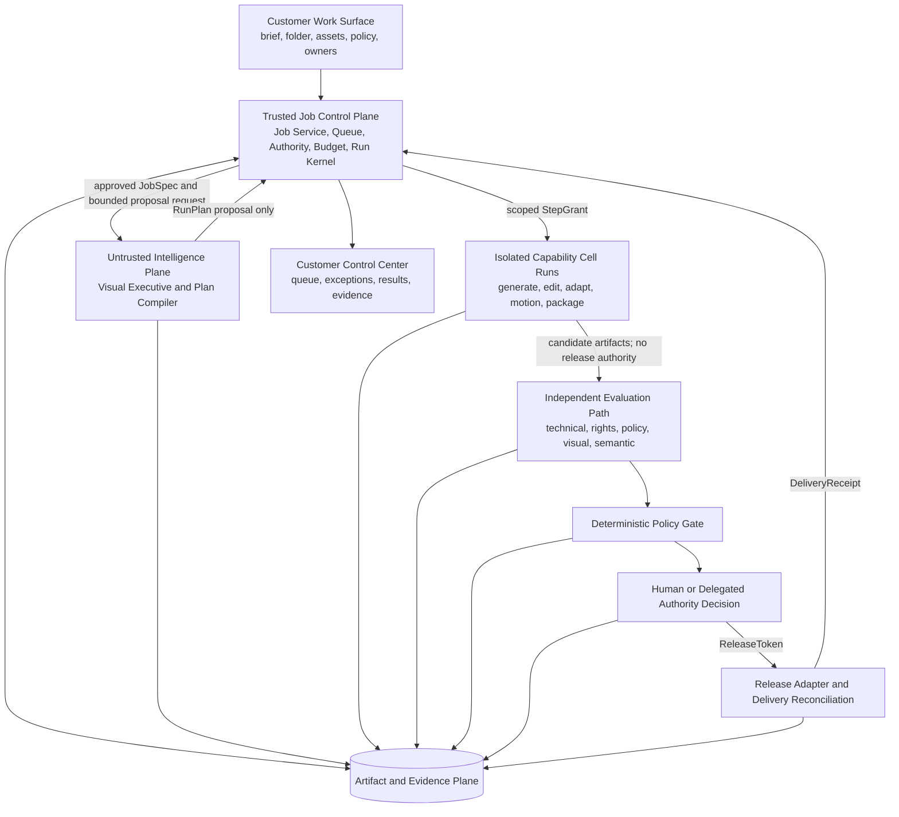
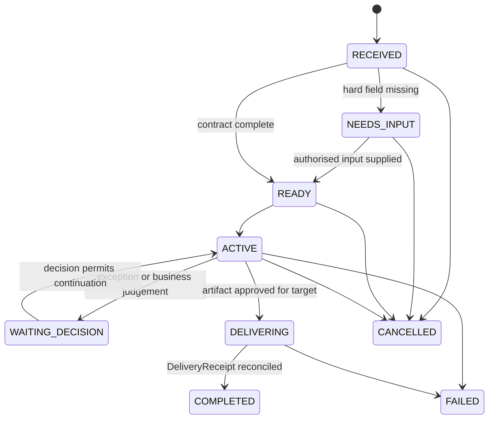
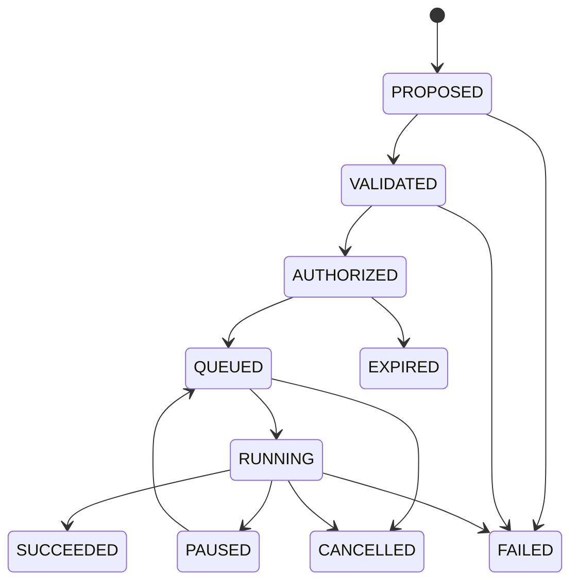
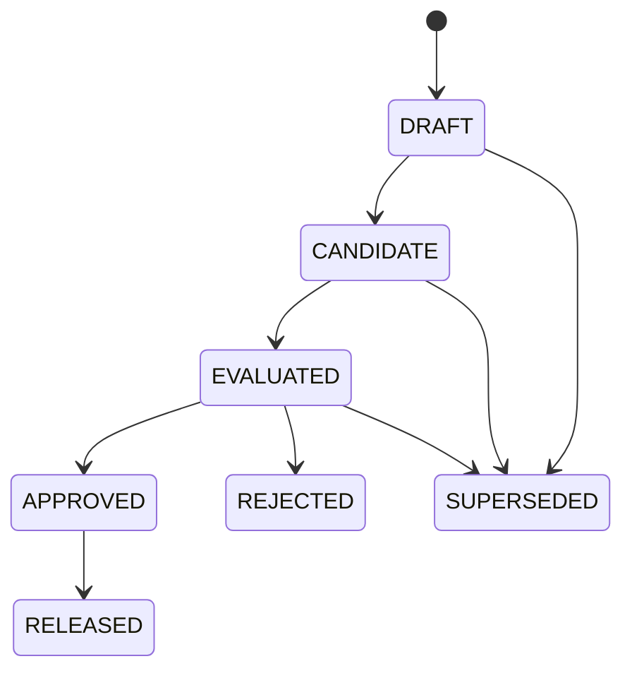
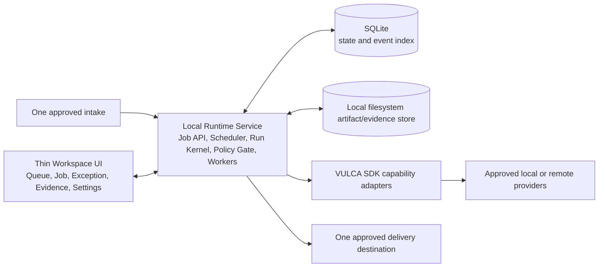

# VULCA Accountable Creative Organization Runtime

**Date:** 2026-08-11

**Status:** Product and system design approved; implementation plan pending

**Product path:** C → D — first make one atomic responsibility highly reliable, then compose multiple responsibilities into an operating unit

**Implementation authority:** This document authorises planning only. It does not claim that the target runtime, enterprise deployment, customer adoption, or role replacement already exists.

## 1. Executive decision

VULCA will become an **accountable creative-organization runtime**: a company assigns it a bounded, recurring creative-production responsibility; VULCA receives the queue, plans the work, generates or transforms artifacts, evaluates them, repairs bounded failures, packages the result, routes exceptions, and records delivery evidence.

The customer-facing product is not generic Agent infrastructure. It is a concrete digital operating unit that fits an existing organizational boundary. Internally, however, it is built on reusable Agent infrastructure: versioned Job contracts, typed Capability Cells, a trusted execution kernel, independent evaluators, authority gates, and append-only evidence.

The vision and first implementation boundary are deliberately different:

- **Company vision:** multiple reliable creative responsibilities compose into a digital creative organization that can own substantial parts of a company's work queue.
- **First implementation:** one bounded visual-production JobClass that can be deployed locally, observed in Shadow mode, and promoted only through evidence.
- **First commercial claim:** a paid production Pilot for a named responsibility.
- **Not yet allowed:** claiming that VULCA has replaced an entire Art Director, Technical Artist, reviewer, creative team, or company function.

The core product promise is:

> Connect one recurring creative-production queue, define its authority and acceptance contract, then let VULCA receive, produce, evaluate, package, and deliver the work.

## 2. Why this is the selected direction

### 2.1 The customer buys responsibility, not orchestration

Infinite canvases, node editors, prompt studios, and role-playing multi-agent chats transfer orchestration work to the customer. That is incompatible with the intended product: the customer should specify the outcome, authority, policy, and exceptions; VULCA should own the internal plan.

VULCA therefore exposes:

- a work queue instead of a pipeline canvas;
- explicit exceptions instead of open-ended chat supervision;
- accepted artifacts and delivery receipts instead of model output alone;
- evidence and bounded authority instead of a generic confidence score;
- organizational JobClasses instead of a marketplace of Agent personas.

### 2.2 VULCA includes Agent infrastructure but is not sold as Agent infrastructure

The internal runtime is an Agent platform. The commercial product is a vertical operating system for creative work.

| Layer | What it is | Who should care |
|---|---|---|
| Company-facing product | Named work queues and responsibilities | Sponsor, workflow owner, operator |
| Organization Pack | Company language, defaults, policies, JobClasses, evaluators | Operator and implementation owner |
| Agent Runtime | Planning, contracts, grants, execution, recovery, evidence | VULCA engineering |
| Capability Cell layer | Typed generation, editing, evaluation, packaging, and integration capabilities | VULCA engineering and advanced debugging |

“AI Art Director”, “AI TA”, “AI Reviewer”, “Campaign Production Unit”, and future role labels are **Organization Packs**. They are not privileged Agent types and must not cause separate backend forks.

### 2.3 C → D is the scale path

The product must not attempt to implement a whole virtual company as one probabilistic Agent.

1. **C — atomic responsibility:** one versioned JobClass owns a recurring, measurable unit of work.
2. **Reliable C:** the JobClass meets declared quality, intervention, SLA, cost, incident, and recovery gates on a representative queue.
3. **Composed C:** several reliable JobClasses share artifacts and policy through typed contracts.
4. **D — operating unit:** the composed system owns a larger work queue; humans handle declared exceptions rather than routine execution.

Adding more model calls, media types, or role labels does not move VULCA from C to D. Only verified queue coverage and operating evidence do.

## 3. Evidence boundary: current state versus target state

This specification is a target design. It must not be used as evidence that the target product has shipped.

### 3.1 Existing foundations

The current repositories document useful foundations:

- VULCA SDK/MCP capabilities for generation, image inspection, semantic decomposition, pixel/layer editing, provider routing, evaluation, and artifact workflows;
- agent-native visual skills and structured artifacts;
- a VULCA Workspace preview with review triage, single-asset review, evidence context, decisions, and a visible human-release boundary.

Relevant existing descriptions are:

- [Agent-native architecture design](2026-04-16-agent-native-architecture-design.md)
- [VULCA Workspace current-state audit](../../product/workspace-current-state-audit.md)
- [VULCA product positioning brief](../../product/2026-04-30-product-positioning-brief.md)

### 3.2 Known current boundary

The Workspace audit records a frontend/session-local preview, not a durable production backend. It does not establish real Job persistence, queue ownership, SDK artifact ingestion, enterprise deployment, customer use, or autonomous release.

The following are target capabilities introduced by this design and must be implemented and tested:

- durable Job Service, scheduler, and Run Kernel;
- scoped authority grants and external-write reconciliation;
- immutable artifact/evidence store;
- independent evaluation and deterministic policy gating;
- TrustDecision promotion and automatic demotion;
- local customer deployment and restart-safe execution;
- paid Shadow Pilot and real-queue operating evidence.

### 3.3 Claim rule

Local builds, demos, screenshots, mock providers, advisory reviews, sender-side activity, or test success are not evidence of deployment, customer adoption, human acceptance, role replacement, or commercial traction.

Every outward-facing claim must carry one of these evidence statuses:

- `DEMO`
- `PILOT`
- `ASSISTED`
- `AUTOMATED`
- `OWNED`
- `REPLACED`

## 4. Product definition

### 4.1 Customer contract

The customer gives VULCA:

- a bounded recurring work queue;
- authorised input assets and their rights/provenance;
- BrandPack and PolicyPack versions;
- explicit acceptance criteria;
- an authority, budget, data, and destination envelope;
- a named Executive Sponsor and Workflow Owner;
- named owners for missing input, policy conflicts, and release decisions.

VULCA owns execution inside that boundary. No probabilistic component may expand the boundary or approve itself.

### 4.2 Product objects

| Object | Purpose |
|---|---|
| `OrganizationPack` | Company vocabulary, dashboard language, policies, defaults, JobClasses, and escalation owners |
| `JobClass` | Versioned template for one recurring business responsibility |
| `JobSpec` | Immutable contract for one accepted work request |
| `RunPlan` | Declarative, versioned proposal for satisfying one JobSpec version |
| `CapabilityManifest` | Typed contract for one replaceable Capability Cell |
| `StepSpec` | Exact planned unit of work bound to inputs, outputs, and dependencies |
| `StepGrant` | Narrow, revocable authority token for one side effect or spend boundary |
| `ArtifactManifest` | Immutable artifact version, hashes, media types, parents, and provenance |
| `EvalSpec` | Versioned evaluation dimensions, evaluator bindings, and thresholds |
| `EvalReport` | `PASS`, `FAIL`, or `ABSTAIN` plus uncertainty and evidence |
| `DecisionRecord` | Human or delegated business decision over exact artifact/evaluation versions |
| `ReleaseToken` | Short-lived authority to release exact artifact hashes to an exact destination |
| `DeliveryReceipt` | Destination acknowledgement of the exact version received |
| `EvidenceEvent` | Append-only causal record of reads, plans, grants, actions, versions, decisions, and writes |
| `TrustDecision` | Signed promotion, restriction, expiry, or demotion for a bounded authority unit |

### 4.3 Non-goals

The MVP is not:

- an infinite canvas;
- a customer-authored DAG or pipeline builder;
- an Agent marketplace;
- a swarm of role-playing chat agents;
- a generic one-shot image generator;
- autonomous public publishing;
- a multi-tenant cloud platform;
- a cross-customer learning system;
- an outcome-billing engine;
- proof that a whole job title has been replaced.

## 5. System architecture and trust boundary

### 5.1 Logical architecture



### 5.2 Trusted Job Control Plane

The trusted control plane is the source of truth for what may happen.

#### Job Service

- stores immutable JobSpec versions;
- applies idempotency keys at intake;
- owns the business-state machine;
- invalidates stale plans and grants when a hard contract field changes.

#### Queue and Scheduler

- leases work to workers;
- enforces timeout, cancellation, concurrency, and dead-letter behavior;
- releases leases while waiting for missing business input;
- resumes from durable state rather than browser state.

#### Authority and Budget

- checks action, provider, data scope, destination, channel, risk tier, spend, attempts, runtime, and expiry;
- issues narrow StepGrants;
- supports explicit revocation and authority expiry.

#### Run Kernel

- validates all state transitions;
- binds every RunPlan to an exact JobSpec hash;
- rechecks safety-critical compiler output deterministically;
- authorises and schedules isolated steps;
- records the causal event history;
- never delegates its authority to the planner or executor.

### 5.3 Probabilistic Intelligence and Execution Plane

#### Visual Executive

The Visual Executive interprets the business intent and proposes a declarative RunPlan from:

- the approved JobSpec;
- JobClass and OrganizationPack versions;
- the Capability Registry;
- approved tenant memory;
- current PolicyPack constraints;
- available budgets and deadlines.

It cannot add tools, rights, data access, destinations, spend, release authority, or unsupported outputs.

#### Plan Compiler

The Plan Compiler resolves exact Cell versions, types, dependencies, evaluator paths, estimated cost, and requested grants. It may use probabilistic mapping, but its output remains a proposal. Safety-critical type, authority, budget, data, and evaluation checks are deterministic and repeated by the Run Kernel.

#### Capability Cell runs

Cells execute generation, transformation, editing, adaptation, motion, evaluation support, packaging, or integration work. Each Cell receives exact input references and a StepGrant. It has no broad tenant access, no release authority, and no direct access to another Cell's hidden state.

### 5.4 Independent Trust and Release Path

Execution cannot grade or release itself.

1. Candidate artifacts enter an evaluator pool selected by the JobClass and PolicyPack.
2. Evaluators return structured reports; they do not authorise release.
3. The deterministic Policy Gate interprets the required reports and conflict rules.
4. Human or previously delegated authority records a DecisionRecord.
5. The system issues a narrow, expiring ReleaseToken.
6. The Release Adapter writes the exact artifact version.
7. A DeliveryReceipt closes the external side effect.

### 5.5 Hard architecture rules

1. The planner cannot authorise itself.
2. Every side effect requires a scoped StepGrant.
3. Every external write requires a DeliveryReceipt.
4. Every high-risk release requires independent evaluation.
5. No component may infer rights, spend, publishing, data use, acceptance, or release authority.
6. History is immutable; changes create new versions and causal events.
7. Unknown external outcomes enter reconciliation, never blind retry.
8. A release failure cannot be converted into success by a probabilistic explanation.

## 6. Job contract

### 6.1 A Job is not a prompt

A raw request may arrive through a form, message, watched folder, or connector. A Contract Compiler applies the JobClass and tenant PolicyPack and produces a versioned JobSpec.

The Job becomes `READY` only when all hard fields are present and authorised.

### 6.2 JobSpec fields

| Group | Required content |
|---|---|
| Identity and provenance | `job_id`, `tenant_id`, version, `job_class`, idempotency key, requester, source references |
| Objective and deliverables | Business objective, audience, channels, artifact types, quantities, technical formats |
| Context and inputs | Asset references, BrandPack version, PolicyPack version, dependencies, source rights |
| Acceptance contract | Required evaluators, thresholds, hard technical gates, human-decision rules, SLA |
| Authority envelope | Allowed actions, providers, channels, write scope, release scope, risk tier |
| Resource envelope | Deadline, maximum spend, attempts, runtime, concurrency, provider restrictions |
| Delivery contract | Destination, package shape, naming, exact artifact version, receipt requirement |
| Escalation and data policy | Missing-input owner, failure owner, retention, privacy, learning permission |

### 6.3 Field provenance

Every normalised field records one of:

- `PROVIDED`: supplied by an authorised source, with a retained reference;
- `INFERRED`: allowed only for descriptive context, with confidence and evidence basis;
- `APPROVAL_REQUIRED`: rights, spend, publishing, data use, acceptance, and authority; never inferred.

Missing authority produces `NEEDS_INPUT`, not a best guess.

### 6.4 Version invalidation rule

Changing acceptance, authority, source rights, destination, data policy, or budget creates a new JobSpec version and invalidates all stale RunPlans, StepGrants, and ReleaseTokens derived from the prior version.

## 7. Runtime state model

Business state, technical execution, and artifact approval are separate state machines joined by immutable references.

### 7.1 Job state



### 7.2 Run state



### 7.3 Artifact state



### 7.4 Runtime invariants

- No approved JobSpec → no Run.
- No StepGrant → no provider spend, file write, or customer-system call.
- No EvalReport → no artifact approval.
- No ReleaseToken → no release.
- No DeliveryReceipt → Job is not complete.
- No mutation of prior Job, plan, artifact, evaluation, or decision versions.
- A repair Run creates a new artifact version; it never overwrites the rejected candidate.

### 7.5 Failure routing

| Failure | Required response | Forbidden behavior |
|---|---|---|
| Missing or ambiguous input | Job → `NEEDS_INPUT`; release lease; spend nothing | Paying a provider to guess the contract |
| Transient provider failure | Bounded retry within the same StepSpec | Unbounded retry or hidden budget increase |
| Quality failure | New repair Run and artifact version, or `WAITING_DECISION` | Overwriting the rejected artifact |
| Rights or policy failure | Block; require authorised policy/input change | Automatic retry or evaluator shopping |
| Evaluator conflict or abstention | Escalate with reports and uncertainty | Averaging disagreement into a pass |
| Budget or deadline exhaustion | Pause/stop and request a new JobSpec version | Continuing on inferred authority |
| Unknown delivery outcome | Enter reconciliation and query destination | Blind retry that may duplicate release |
| Cancellation or revocation | Revoke future grants; quarantine late results | Treating late provider output as authorised |
| Runtime crash | Replay events/checkpoints and resume idempotently | Reconstructing state from UI or memory |

## 8. Capability Cell protocol

### 8.1 Definition

A Cell is a typed, versioned, replaceable capability. It is not a conversational persona.

Its manifest contains:

| Group | Required content |
|---|---|
| Identity and version | Capability ID, version, kind, owner, maturity, deprecation state |
| Typed inputs and outputs | Schemas, media types, required refs, ArtifactManifest shape |
| Execution profile | Tool/provider adapter, deterministic/stochastic mode, sandbox, data locality |
| Authority requirements | Read scopes, provider spend, file writes, external side effects |
| Resource profile | Cost estimate, latency range, timeout, concurrency, cache policy |
| Evaluator bindings | Required checks, thresholds, calibration version, uncertainty route |
| Failure contract | Retryable codes, compatible fallback, compensation, quarantine behavior |
| Evidence hooks | Provider receipt, step events, hashes, customer-safe logs |

### 8.2 Maturity levels

| Maturity | Meaning |
|---|---|
| `NATIVE` | VULCA owns the typed contract, test corpus, evaluator binding, replay behavior, and operational target; the base model may remain external |
| `ORCHESTRATED` | A stable adapter controls an external provider/tool and records evidence, but reliability or fallback remains provider-dependent |
| `INTEGRATED` | VULCA can hand work to an external app or human and receive a result/receipt, but cannot own internal execution |
| `UNSUPPORTED` | No compatible contract or evidence route exists; planner must refuse or escalate |

Capability maturity and JobClass operating status are different. A JobClass may compose external `ORCHESTRATED` Cells and still become reliable if the full contract is measured and failure is bounded.

### 8.3 Orchestration sequence

1. Visual Executive reads an approved JobSpec and proposes a RunPlan.
2. Plan Compiler resolves exact Cell versions and evaluator paths.
3. Run Kernel validates types, maturity, authority, data, budget, deadline, and independent-evaluation coverage.
4. Authority service issues scoped StepGrants.
5. Scheduler runs isolated Cells.
6. Cells emit immutable artifacts, receipts, failures, and safe summaries.
7. Run Kernel mediates every artifact handoff.
8. Independent evaluators assess the candidate.
9. Policy Gate chooses pass, repair, block, abstention escalation, or human decision.

### 8.4 Orchestration invariants

- No Cell-to-Cell calls.
- No shared hidden scratch context.
- No spontaneous replanning.
- No hidden self-evaluation.
- No silent provider fallback.
- No unsupported plan.
- No private chain-of-thought product surface.
- Only immutable artifact references cross step boundaries.

### 8.5 Replanning

Replanning is explicit and versioned. A PlanRevision may be proposed only for:

- missing or incompatible input;
- declared capability unavailability;
- a repairable EvalReport failure;
- an authorised human or policy change.

A fallback must satisfy the same output/evaluation contract, receive a new cost estimate, and pass a fresh grant decision. A JobSpec change creates JobSpec `v+1`; an implementation-only change creates RunPlan `v+1`.

### 8.6 Initial planning boundary

The MVP supports bounded plan synthesis over two approved templates. The planner may select compatible Cells, providers, and declared repair routes. It may not invent arbitrary tools, unbounded loops, or new graph structures.

General dynamic planning is deferred until replay and Golden Job evidence demonstrate that template-bound orchestration is insufficient.

## 9. Evaluation, evidence, and trust

### 9.1 Independent evaluation stack

| Layer | Responsibility |
|---|---|
| Technical validators | File integrity, dimensions, codec, colour profile, safe area, naming, package completeness |
| Rights and policy checks | Provenance, licence, consent, prohibited content, channel policy, BrandPack constraints |
| Visual and semantic judges | Brief alignment, brand fit, composition, consistency, and JobClass-specific quality |
| Human/business decision | High-risk novelty, abstention, disagreement, business judgment, and release |

Every evaluator returns:

- `PASS`, `FAIL`, or `ABSTAIN`;
- exact subject artifact hash/version and intended channel;
- evaluator, code/model/provider, EvalSpec, and calibration versions;
- dimension-level results and hard failures;
- uncertainty and confidence where meaningful;
- evidence references and safe structured repair hints.

Only the Policy Gate interprets reports. A model score alone cannot authorise a high-risk release.

### 9.2 Anti-gaming rules

- Executor cannot choose its judge.
- JobClass and PolicyPack bind required evaluators before output is seen.
- Evaluator/version changes require replay against frozen and unseen cases.
- Customer-specific and Golden holdouts are not reduced to repair prompts.
- Evaluator disagreement raises uncertainty; it is not averaged away.
- Judge drift is monitored separately from executor quality.

### 9.3 Evidence model

Every EvidenceEvent answers:

1. **Who/what acted?** Actor, component, Job, Run, Step, and object references.
2. **Why was it allowed?** StepGrant, policy version, and authority scope.
3. **What changed?** Input/output hashes, prior/new state, and causal parent.
4. **What did it cost?** Provider receipt, spend, latency, and retries.
5. **What external proof exists?** DecisionRecord, override, ReleaseToken, or DeliveryReceipt.

Evidence is append-only, tenant-bound, and accessible in two views:

- customer view: milestones, exceptions, decisions, versions, SLA, cost, risk, and receipts;
- developer view: RunPlan graph, calls, structured summaries, evaluator reports, retries, diffs, and checkpoints.

Neither view exposes private chain-of-thought.

### 9.4 Authority graduation

Trust is never granted to “the Agent” globally. The trust unit is:

```text
JobClass × Action × Channel × RiskTier
```

The authority ladder is:

```text
OBSERVE → SHADOW → DRAFT → EXECUTE → RELEASE → OPTIMIZE → OPERATE
```

Promotion requires a signed TrustDecision containing:

- predeclared thresholds and evidence window;
- continuous, non-cherry-picked queue coverage;
- quality, SLA, cost, and intervention results;
- incident status;
- tested rollback, revocation, and reconciliation;
- named approving sponsor or delegate;
- exact scope, versions, expiry, and demotion rules.

Automatic demotion is triggered by:

- a high-severity policy or release incident;
- quality, SLA, intervention, or cost drift;
- provider, evaluator, BrandPack, or PolicyPack change;
- new task distribution outside the evidence window;
- delivery reconciliation failure;
- authority expiry or explicit revocation.

### 9.5 Trust metrics remain separate

VULCA must not collapse operating performance into one opaque trust score.

Measure separately:

- representative queue coverage;
- first-pass acceptance;
- human interventions and hands-on minutes per accepted Job;
- end-to-end cycle time and SLA;
- provider, compute, and human cost per accepted Job;
- policy, release, duplication, and rollback incidents;
- retry, rollback, and reconciliation quality;
- input, provider, evaluator, and outcome drift.

### 9.6 Authority is not replacement

| Operating status | Meaning | Evidence required |
|---|---|---|
| `ASSISTED` | Human remains primary; VULCA contributes to tasks | Task-level usefulness and acceptance |
| `AUTOMATED` | VULCA executes repeatable tasks; human controls the flow | Stable task success and bounded failure handling |
| `OWNED` | VULCA carries the defined work queue; humans handle exceptions | Continuous real-queue operation against SLA, cost, quality, and risk |
| `REPLACED` | Human is removed from the primary execution path | Counterfactual capacity proof that the same queue would otherwise require measurable human capacity |

A JobClass may have `RELEASE` authority and remain only `AUTOMATED`. A VULCA-managed internal queue may be `OWNED` without public-release authority. Permission and labour substitution are separate evidence systems.

The MVP supports `SHADOW → DRAFT → EXECUTE`, with human release mandatory.

## 10. Product experience

### 10.1 Queue-first information architecture

The default product surface is the work queue, not chat and not an infinite canvas.

| Surface | Customer purpose |
|---|---|
| Work Queue | Jobs, due dates, authority, current state, blockers, SLA, and owner |
| Job Detail | Outcome, milestones, artifact versions, evaluations, cost, and delivery status |
| Exception Inbox | One explicit decision at a time, with context, safe options, and consequences |
| Trust and Evidence | Coverage, interventions, incidents, receipts, authority scope, and operating status |
| JobClass Settings | Brand/Policy Packs, connectors, budgets, acceptance, authority, and escalation |

“Direct VULCA” chat is a secondary surface for intake, explanation, or requesting an override. It is not the home screen and not a hidden orchestrator.

### 10.2 Customer view versus developer view

#### Customer/operator view

Show:

- requested outcome and deadline;
- current state and current exception;
- decision options and consequences;
- previews and accepted artifact versions;
- quality, cost, risk, and delivery proof;
- one accountable VULCA identity.

Hide by default:

- internal graph construction;
- provider-specific implementation detail;
- Cell inventory;
- raw debug logs.

#### Developer/debug view

Show on demand:

- RunPlan DAG and exact versions;
- step state and grant scope;
- tool/provider calls and receipts;
- artifact diffs and lineage;
- EvalReports and calibration versions;
- retries, checkpoints, costs, events, and reconciliation state.

### 10.3 Usability principles

- **Exception-first:** routine work stays quiet; attention is requested only for named decisions.
- **Progressive disclosure:** responsibility and proof first, graph internals on demand.
- **No prompt engineering requirement:** intake uses JobClass language and validated fields.
- **Safe defaults, explicit authority:** templates may fill descriptive defaults but never permissions.
- **Visible stop state:** every active Job can be cancelled or authority-revoked from the control surface.
- **No success theatre:** blocked, abstained, stale, and reconciling states are visible.
- **One accountable surface:** internal Cell composition does not create multiple customer-facing personalities.

## 11. Deployment architecture

### 11.1 MVP: local single-tenant runtime

The MVP uses a thin frontend and a durable backend, installed and started together.



MVP deployment properties:

- one customer/tenant per runtime;
- one startup entrypoint for UI, service, and worker;
- UI may close while jobs continue;
- runtime restart replays events and checkpoints;
- SQLite indexes state and events;
- filesystem/content-addressed storage holds artifacts and evidence;
- current VULCA SDK is exposed through Capability Adapters;
- raw assets remain local by default;
- provider calls follow JobSpec data policy;
- credentials are loaded from keychain/environment-backed adapters, never JobSpecs or logs;
- no public ingress or autonomous public publishing by default.

The logical components may initially run in one process plus a worker. Their contracts and state boundaries must remain explicit so they can be separated later without rewriting product semantics.

### 11.2 Why the backend is non-negotiable

Queue ownership, leases, spend, retries, idempotency, checkpoints, receipts, revocation, and recovery cannot live in a browser session. The frontend is a human-decision surface; the backend is the accountable operating system.

### 11.3 Later hybrid deployment

After the local spine works, VULCA may add:

- a cloud Control Plane for policy versions, runtime registration, signed TrustDecisions, updates, and bounded telemetry;
- a Customer Runtime beside private assets and customer systems;
- metadata/event synchronisation without uploading raw assets by default;
- headless deployment and approved enterprise connectors.

Deferred deployment work includes multi-tenant cloud execution, broad RBAC, several private-deployment variants, and cross-tenant learning.

## 12. First build-and-sell JobClass

### 12.1 External responsibility

The first sellable responsibility is:

> **Campaign Production & Release Draft** — approved brief, Brand/Policy Pack, and source assets become a validated multi-format visual asset package, release recommendation, and delivery receipt. Human release remains mandatory.

This includes generation. VULCA is not only a reviewer: it may generate a key visual, transform approved source material, produce variants, repair bounded failures, evaluate, package, and deliver a release draft.

### 12.2 MVP templates

The runtime contains two bounded templates, but a paid Pilot activates only one contracted JobClass.

#### `campaign-static-asset-pack.v1` — Native Golden Job

Purpose:

- prove the full Job/Run/Artifact/evaluation/release-draft spine;
- produce or adapt a bounded static campaign package;
- serve as the first paid Pilot candidate.

Inputs:

- approved brief;
- target audiences/channels and static format list;
- authorised source assets and rights;
- BrandPack and PolicyPack;
- declared technical and visual acceptance rules;
- budget, deadline, attempts, and destination.

Outputs:

- generated or transformed candidate assets;
- channel/format variants;
- ArtifactManifest with provenance and versions;
- technical, rights/policy, and visual EvalReports;
- exception and DecisionRecords where required;
- release recommendation;
- customer-approved delivery package and DeliveryReceipt.

#### `campaign-cross-media-pack.v1` — graded cross-media Job

Purpose:

- test composition of static, motion/video, and cross-media consistency Cells;
- expose capability maturity and provider dependence;
- remain Shadow-only until its own evidence gates are met.

It must not inherit the static Job's authority or operating status.

### 12.3 MVP authority

The first paid JobClass may progress through:

```text
SHADOW → DRAFT → EXECUTE
```

It may not autonomously publish. A human reviews and authorises release. The runtime still records the exact artifacts, decision, destination, and delivery receipt needed for later promotion.

### 12.4 Explicit first loop

A customer must be able to:

1. start the local VULCA workspace;
2. connect one approved brief/asset intake and one output folder;
3. submit a Campaign Production Job without authoring a pipeline;
4. see queue state and milestones;
5. receive only explicit exceptions;
6. preview generated/transformed artifacts and evidence;
7. approve the release draft;
8. receive the exact package and delivery receipt;
9. close/reopen the UI or restart the service without losing accountable state.

If this narrow loop cannot become reliable and paid, adding more AI roles or media types only multiplies failure.

## 13. Paid Pilot product

### 13.1 Pilot contract

The Pilot is fixed-scope and paid. It includes:

- one versioned JobClass;
- one named sponsor and one workflow owner;
- one intake route and one delivery route;
- a capped representative Job Capacity;
- a declared provider-spend allowance and overage rule;
- a baseline replay set and live Shadow queue;
- local runtime, evidence view, and exception workflow;
- a final TrustDecision, capacity/ROI report, and expansion recommendation.

It excludes:

- all creative work or arbitrary prompts;
- unlimited bespoke connectors;
- customer-only product forks;
- autonomous public publishing;
- cross-customer learning from private assets;
- a pre-evidence promise to replace a named employee or role;
- free product exploration disguised as a production Pilot.

### 13.2 Customer qualification

Accept a company only if:

- the work recurs with enough queue volume to measure;
- a sponsor controls budget and an operator controls decisions;
- authorised inputs, source rights, and accepted outputs can be provided;
- the task boundary and common exceptions can be named;
- a human/process baseline can be reconstructed;
- the company will run Shadow mode, record intervention, and pay.

Decline or reframe if:

- the request is a one-off showcase;
- no one can authorise assets, policy, or release;
- success is only “looks good” with no acceptance owner;
- every media type, channel, and workflow is demanded at once;
- private data cannot be handled under an approved policy;
- the buyer demands a replacement claim before comparative evidence.

### 13.3 Gated operating transfer

1. **Qualify:** verify queue, sponsor, operator, rights, budget, and bounded outcome.
2. **Capture baseline:** map real inputs, outputs, exceptions, cycle time, human minutes, cost, and accepted prior Jobs.
3. **Configure locally:** freeze JobClass, Brand/Policy Packs, data rules, intake/output, and release owner.
4. **Shadow:** run a representative live queue without production effect.
5. **Draft/Execute:** VULCA owns bounded steps; customer releases; every intervention becomes evidence.
6. **Trust review:** sign `GO`, `REFRAME`, or `KILL` for the exact proven boundary.

### 13.4 Stage gates

#### Internal Pilot Ready

- Representative Golden Jobs meet their predeclared JobClass thresholds consecutively.
- There is no hidden manual rescue.
- Evidence is complete.
- Restart, retry, rollback, revocation, and reconciliation are tested.
- Exact corpus size, thresholds, and consecutive-run requirement are declared in the JobClass test specification before the gate is run.

#### Paid Shadow Ready

- Real intake can be connected without production effect.
- Baseline and comparison method are frozen.
- Data rights, exception owner, budget, and stop switch are active.
- The customer understands what Shadow does and does not prove.

#### Draft/Execute Ready

- Predeclared quality, queue-coverage, intervention, SLA, cost, and incident gates are met.
- A signed TrustDecision grants only the proven action/channel/risk scope.
- Human release remains mandatory.

### 13.5 Exit decisions

| Decision | Meaning |
|---|---|
| `GO` | Increase Job Capacity or add the next Cell/JobClass without weakening the proven boundary |
| `REFRAME` | Value exists but intervention, cost, quality, or reliability is unacceptable; narrow the Job or improve the failing Cell/evaluator |
| `KILL` | No residual value over the human/cheap baseline, instability persists, willingness to pay is absent, or the boundary cannot be made finite |

### 13.6 Commercial model

The commercial sequence is:

1. fixed paid Pilot;
2. recurring responsibility/capacity subscription by JobClass, included Job Capacity, and SLA;
3. outcome-linked pricing only after attribution and baselines become trustworthy.

Exact pricing is a customer-discovery decision, not an architecture decision. VULCA must avoid both per-seat positioning and outcome claims that cannot be causally attributed.

## 14. One-founder build-and-sell loop

Development and customer discovery run in parallel but share one evidence loop.

### Build lane

- implement the local Job spine and one Golden JobClass;
- turn every defect into an explicit contract, state, policy, Cell, evaluator, or UX requirement;
- do not hide founder intervention;
- do not generalise before the first queue works.

### Design-partner lane

- approach companies with real recurring queues, not generic interest in AI;
- collect de-identified prior Jobs and baseline data only with permission;
- sell the same bounded Pilot;
- reject bespoke forks that do not improve the shared substrate;
- never call a prospect a customer or partner before an actual agreement exists.

Customer evidence informs the JobClass. It does not waive architecture, rights, human-release, or promotion gates.

## 15. MVP functional requirements

| ID | Requirement | Acceptance evidence |
|---|---|---|
| `FR-01` | Intake one request/form or watched-folder event idempotently | Duplicate intake produces one Job and an evidence event |
| `FR-02` | Compile a versioned JobSpec and block missing hard fields | Missing authority produces `NEEDS_INPUT` before provider spend |
| `FR-03` | Persist and schedule Jobs independently of the UI | Job continues after tab closure and resumes after service restart |
| `FR-04` | Propose and compile a bounded RunPlan | Plan binds exact JobSpec, Cell, evaluator, and policy versions |
| `FR-05` | Issue narrow StepGrants | Side effects without a valid grant are rejected and recorded |
| `FR-06` | Execute isolated Capability Cells | Cells receive only declared inputs and emit manifests/receipts |
| `FR-07` | Version artifacts immutably | Repair creates a new version and preserves rejected evidence |
| `FR-08` | Run independent evaluation and Policy Gate | No approval path exists without required EvalReports |
| `FR-09` | Route explicit exceptions | Operator sees context, options, consequences, and decision owner |
| `FR-10` | Authorise and reconcile delivery | Release requires a token; completion requires a receipt |
| `FR-11` | Expose customer and developer evidence views | Every material action is causally traceable without chain-of-thought |
| `FR-12` | Support cancellation, revocation, retry, and reconciliation | Late/unknown effects are quarantined or reconciled, not blindly repeated |
| `FR-13` | Compute separate operating metrics | Coverage, acceptance, intervention, SLA, cost, incident, recovery, and drift remain independently visible |
| `FR-14` | Record bounded TrustDecisions | Promotion/demotion applies only to exact JobClass/action/channel/risk scope |

## 16. Non-functional requirements

### Reliability

- durable source of truth outside the frontend;
- idempotent intake and external side effects;
- bounded retries and explicit dead-letter state;
- checkpointed, restart-safe execution;
- no silent failure or silent fallback.

### Security and privacy

- local single-tenant boundary in MVP;
- least-privilege StepGrants;
- secrets outside artifacts, prompts, and logs;
- raw customer assets stay local by default;
- outbound provider access follows explicit data policy;
- no cross-tenant learning or evidence promotion;
- revocation and stop controls are visible and tested.

### Auditability

- immutable IDs, versions, hashes, and causal parents;
- provider, evaluator, policy, and model versions retained;
- human decisions and overrides attributable to an authorised actor;
- no completion without external delivery proof.

### Provider independence

- provider-specific behavior stays behind Capability Adapters;
- no model/provider name appears as a permanent JobClass requirement unless explicitly policy-bound;
- fallback is declared, compatible, re-costed, and re-authorised.

### Usability

- no pipeline authoring for normal customers;
- default queue and exception surfaces use business vocabulary;
- technical detail is available without becoming the primary interface;
- all blocked and uncertain states remain visible.

## 17. MVP scope

### Included

- one local intake and one delivery destination;
- local Job Service, queue/scheduler, Run Kernel, artifact/evidence store;
- current VULCA SDK through Capability Adapters;
- two bounded plan templates;
- one Native Golden static JobClass candidate;
- one graded cross-media JobClass in Shadow/testing;
- independent technical, rights/policy, and visual evaluation;
- human release;
- customer queue, Job detail, Exception Inbox, evidence, and JobClass settings;
- `SHADOW → DRAFT → EXECUTE` evidence and authority states;
- one fixed-scope paid Pilot contract.

### Explicitly deferred

- autonomous public publishing and optimization;
- general dynamic planning;
- many connectors;
- customer-authored workflows;
- multi-tenant cloud execution;
- complex RBAC and enterprise billing;
- headless/private deployment variants;
- cross-tenant learning;
- automatic role-replacement analytics;
- `RELEASE`, `OPTIMIZE`, or `OPERATE` authority;
- a `REPLACED` marketing claim.

## 18. Grill: principal risks and kill signals

| Risk | Why it can kill the company | Required response or kill signal |
|---|---|---|
| Role-label inflation | “AI Art Director/TA” can promise more than bounded capabilities deliver | Sell JobClasses; kill any role claim not backed by queue evidence |
| Hidden founder labour | A one-person team can silently become the actual operator | Record every intervention; reframe if accepted Jobs require persistent hands-on rescue |
| Evaluator unreliability | A weak judge creates false confidence and unsafe release | Calibrate against humans/holdouts; retain human release; kill autonomous promotion if judge outcomes do not predict acceptance |
| Long-tail work variance | A broad creative queue may be impossible to bound | Narrow the JobClass; kill the Pilot if representative coverage remains low |
| Provider dependence | Model changes can break quality, cost, or policy | Version adapters and auto-demote on change; no silent fallback |
| Integration/services trap | Bespoke connectors may consume the founder and prevent product reuse | One intake/output first; decline forks whose substrate value is low |
| Poor unit economics | Provider and review costs may erase labour savings | Measure cost per accepted Job; kill or reframe if no residual over a cheap baseline |
| Weak customer baseline | “Better” and “replacement” become impossible to prove | Require prior Jobs/process data; no baseline means no replacement claim |
| Rights/privacy failure | Creative assets and publishing rights are high-risk | Explicit provenance/data policy; block rather than infer |
| Buyer politics | Sponsors may like the demo while operators resist operating transfer | Require both sponsor and workflow owner; no paid Pilot without both |
| UX supervision burden | If customers must watch graphs/prompts, VULCA has not owned the work | Queue/exception UX; reframe if routine supervision remains necessary |
| Correlated composition failure | Several reliable Cells can still fail as a system | Promote JobClasses end-to-end; never infer D-level trust from Cell-level tests |
| Platform commoditisation | Better foundation models reduce value of raw generation | Defend contracts, control, evaluation, recovery, evidence, and workflow ownership—not model output alone |

The direction should be killed or materially reframed before broad platform investment if a paid, bounded JobClass cannot demonstrate all three:

1. measurable residual value over the strongest cheap/no-Agent baseline;
2. stable operation with bounded human intervention and failure recovery;
3. customer willingness to pay for responsibility rather than a demo or services project.

## 19. Decisions deferred to implementation planning

The following are intentionally not fixed by this product design:

- exact module/file layout inside the current repositories;
- whether the first local service is packaged as a CLI, desktop wrapper, container, or signed binary;
- final SQLite schema and artifact-store layout;
- exact frontend reuse versus integration with the separate VULCA Workspace repository;
- exact provider and Cell set for the first Golden corpus;
- numeric evaluation, reliability, and consecutive-run thresholds;
- the first Pilot customer, segment, price, and legal agreement;
- cloud Control Plane technology and enterprise connector catalogue.

These decisions must be made in the implementation plan using the actual current checkout, dependency graph, and targeted tests. No implementation begins until this specification receives final user review.

## 20. Design acceptance summary

The approved design commits VULCA to these choices:

1. The product is a digital creative operating unit, not an infinite canvas or generic copilot.
2. External packaging uses concrete organizational responsibilities; internal architecture uses reusable JobClasses and Cells.
3. VULCA generates as well as evaluates, repairs, packages, and delivers.
4. A probabilistic Visual Executive proposes; a trusted kernel authorises.
5. Cells exchange immutable artifacts, not hidden conversations.
6. Evaluation is independent; policy and authority remain separate from execution.
7. Trust is promoted per `JobClass × Action × Channel × RiskTier` and automatically demoted on drift or incidents.
8. Authority, operating ownership, and labour replacement are distinct claims.
9. The product UI is queue-first and exception-first; chat is secondary.
10. The MVP is a local durable runtime with a thin frontend and restart-safe backend.
11. The first commercial unit is a fixed-scope paid Campaign Production Pilot with human release.
12. VULCA advances from C to D only by composing responsibilities that have independently earned operating evidence.
